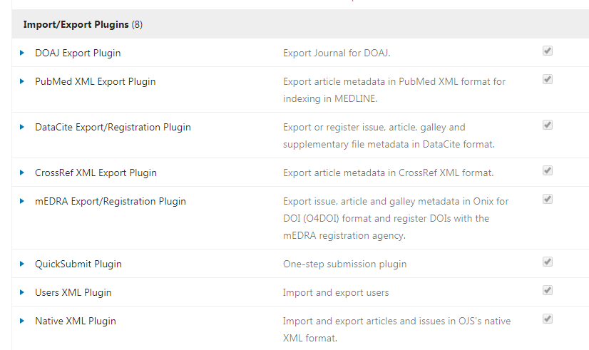
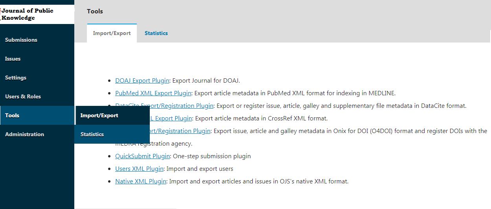
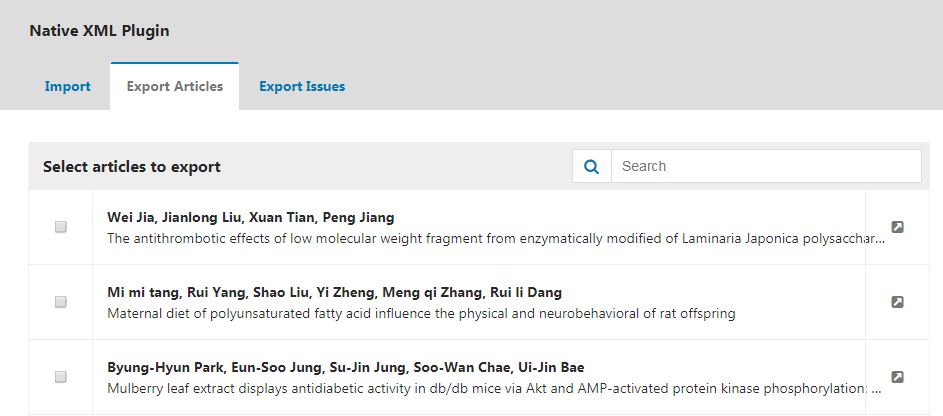

# Import and export articles and issues

Articles and issues can be quickly imported into OJS using the Quick Submit Plugin or the Native XML Plugin \(formerly the Articles and Issues XML Plugin\).  The Quick Submit Plugin is a useful tool for importing 5-10 articles, but for larger numbers of articles and issues, or if you have your metadata in a transformable format, you may wish to use the Native XML Plugin.

## Quick Submit Plugin

The Quick Submit Plugin allows you to quickly add complete submissions to an issue. It provides a one-step submission process for editors needing to bypass the traditional submission, review, and editing process.

The Quick Submit Plugin can be used in the following cases:

* Journals who are using OJS to display and publish their content without using the editorial workflow
* Journals that were published using another platform and are migrating to OJS, when a conversion tool for that platform is not available
* Journals that were originally published in print and have since been digitized

To use this plugin, you will need the following:

* To be enrolled as an Editor or Journal Manager
* A set of ready-to-publish files \(e.g., PDFs\)
* All of the metadata for the files \(e.g., author names, titles, abstracts, etc.\)

First, ensure that the Quick Submit Plugin has been installed and enabled for your journal.  You will need to have the Journal Manager role to enable the plugin and the Administrator role to install the plugin.

1. Go to Settings &gt; Website &gt; Plugins
2. Under Installed Plugins, look for the Quick Submit Plugin.  If you see it listed, skip to step 8.
3. If you do not see the Quick Submit Plugin under Installed Plugins, go to the Plugin Gallery tab.  
4. Click on Quick Submit.  A popup box will open. 
5. Click on Install.  If you do not see the Install button, you will need to ask the Administrator of your site to install the plugin for you.
6. A popup box will open and ask “Are you sure you wish to install this plugin?”  Click OK and wait a few minutes while the installation completes.
7. After the plugin has been installed, go back to the Installed Plugins tab and find the Quick Submit Plugin.
8. Check the box to the right of the plugin name and description to enable the plugin.

Next you will need to create the issues \(or issue\) that will contain the new articles you are importing.

1. Go to Issues &gt; Future issues and select Create Issue.
2. Enter metadata for the issue and click Save.
3. Do this for all of the issues you are uploading articles for.

Next you can import each article with the Plugin.

1. Go to Tools &gt; Import/Export and select Quick Submit Plugin.
2. Upload a cover image if you have one.  This field is optional and can be ignored.
3. Choose the section of the journal that the article will appear in from the drop-down list in the Section field.
4. Enter the metadata for the article in the other fields.
5. Under List of Contributors, click Add Contributor to enter the names of authors and other contributors to the article.   
6. Under Galleys, click Add Galley to upload a PDF file of the article.  A popup box will open where you can enter the Galley Label and language of the galley.  Once you click Save, another box will open where you can select the Article Component and upload the file.
7. At the end of the Quick Submit Plugin form, you can select whether you want the article you are adding to be published immediately or unpublished, if you wish to publish it later.
8. When you have finished entering all data for the article, click Save.

## Native XML Plugin

The Native XML Plugin in OJS 3.x replaces the Articles and Issues XML Plugin, which was used in OJS 2 to import article and issue metadata into and out of OJS in an XML file.  It can be used to import and export single or multiple issues and/or articles, including comprehensive metadata. It can be used in the following cases:

* Moving article and issue metadata from one OJS journal to another
* Moving a large number of back issues and articles into OJS

To use this plugin you will need the following:

* A basic understanding of XML
* To be enrolled as a Journal Manager in the OJS journal

If you are importing data, first create the XML import file.  Here are links to sample XML import files and XML schemas:

* Sample XML file for article metadata: https://github.com/pkp/ojs/blob/master/plugins/importexport/native/sample.xml
* Sample XML file for issue metadata: https://github.com/pkp/ojs/blob/master/tests/data/60-content/issue.xml
* XML schema for use across PKP software applications: https://github.com/pkp/pkp-lib/blob/master/plugins/importexport/native/pkp-native.xsd
* XML schema for use in OJS: https://github.com/pkp/ojs/blob/master/plugins/importexport/native/native.xsd

\* Please note that the XML format used by the Native XML Plugin for OJS 3 is different from the XML format for the Articles and Issues XML Plugin used in OJS 2.  If you export data from OJS 2 and want to import it into OJS 3, you will have to edit the XML file first. Also note that the schema is revised periodically; if exporting from one version of OJS and importing into a different version, you may need to adjust the XML slightly to account for these changes.

Here are some things to consider:

* Be sure to define the document type appropriately using &lt;!DOCTYPE ...&gt;.
* Your XML file should UTF8-encoded.
* Dates should be specified as YYYY-MM-DD.
* To import a file, you can use &lt;embed&gt; to place a file directly within your XML document, or use &lt;href&gt; to link to one.
* If you use the &lt;embed&gt; tag you will have to base64-encode your files. Using &lt;embed&gt; with a base64-encoded file would look something like this: \[screenshot needed\]
* You can link to full URLs as well as local files using &lt;href&gt;. A full URL link would look like the following: \[screenshot needed\]
* You can use local linking if your galleys are already stored on the destination machine, but in this case you need to launch the import from the command line. Importing a local file would look like the following: \[add screenshot\]
* Some elements can support embedded HTML tags, such as the abstract element. If you do embed HTML within your document, remember to wrap the HTML within &lt;!\[CDATA\[\]\]&gt; tags.
* If your journal supports more than one locale, you can include translated terms in a separate entry: \[screenshot\]
* If you make any typographical errors in the data you are trying to import, you may end up with duplicate or split entries: for example, if your journal already has a section "Articles" with the initials ART, but you mistype in your XML file &lt;abbrev locale="en\_US"&gt;AR&lt;/abbrev&gt; instead of &lt;abbrev locale="en\_US"&gt;ART&lt;/abbrev&gt;, a new journal section with the initials AR will be created, and that one article will be added to it. This can be easily fixed pre-import, but difficult to clean up after.

You should validate your XML file before importing it.  If you are using an XML editor tool, such as Liquid XML Editor or Oxygen XML, you can validate the file there.  If the XML is not valid an error message will display identifying what line\(s\) have errors.

Once you have the valid XML import file, you can import it:

1. Login to OJS as Journal Manager
2. Go to Tools &gt; Import/Export &gt; Native XML Plugin
3. Under the Import tab, click Upload File and select your XML file
4. Click Import
5. You will be notified of any errors, or if the import was successful.

To export article and issue metadata using the Native XML Plugin:

1. Login to OJS as Journal Manager
2. Go to Tools &gt; Import/Export &gt; Native XML Plugin
3. Depending on whether you are exporting article or issue metadata, go to the Export Articles or Export Issues tab
4. Select the articles or issues you wish to export by checking the box beside them.  
5. Click Export
6. The articles or issues will be exported in XML format, and can be imported to this or another journal

\* Please note that using this plugin to export articles and issues will not only export all relevant metadata, but will include all article files \(HTML, PDF, etc.\) embedded within the XML document in Base64 encoding. This can result in large, cumbersome XML files, especially when multiple issues are exported at once. Opening them in an editor to view or change any XML data or metadata may be taxing for your computer, and it may take some time to download and/or upload said files, depending on your connection and the resources of the source server.

  

