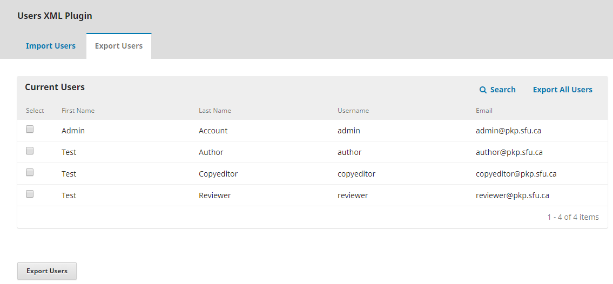

# Import and export users

The Users XML Plugin can be used to import and export users and their roles. It can be used in the following cases:

* Moving user accounts from one OJS journal to another
* Moving user accounts from another system into OJS
* Moving user accounts from OJS into another system
* Exporting user data from OJS, modifying it, and importing it back into OJS

To use this plugin you will need the following:

* A basic understanding of XML
* To be enrolled as a Journal Manager in the OJS journal

If you are importing users into OJS, first create the XML import file.  Here is a sample XML import file: https://github.com/pkp/ojs/blob/master/plugins/importexport/users/sample.xml

\* Please note that the XML format used by the Users XML Plugin in OJS 3 is different from the XML format used by the Plugin in OJS 2.  If you export data from OJS 2 and want to import it into OJS 3, you will have to edit the XML file first.

Here are some things to consider:

* Be sure to define the document type appropriately using &lt;!DOCTYPE ...&gt;.
* Your XML file should UTF8-encoded.
* &lt;firstname&gt;, &lt;lastname&gt; and &lt;email&gt; are mandatory.
* If you allow the system to generate passwords for the users you are uploading, you can optionally allow the system to email the users with their account credentials. This option can be found on the Users XML Plugin Page \("Send a notification email to each imported user containing the user's username and password."\).
* You can require the user change their password when they next log in by setting the password attribute "change" to "true": &lt;password must\_change="true"&gt;myoldpassword&lt;/password&gt;
* The default password encryption is "plaintext" \(ie., none\). Encrypted assumes it was encrypted by Validation::encryptCredentials\(\) and is using the same encryption algorithm used by the system.
* If the imported file contains any usernames or email addresses that already exist in the system, the user data for those users will not be imported and any new roles to be created will be assigned to the existing users.

You should validate your XML file before importing it.  If you are using an XML editor tool, such as Liquid XML Editor or Oxygen XML, you can validate the file there.  If the XML is not valid an error message will display identifying what line\(s\) have errors.

Once you have the valid XML import file, you can import it:

1. Login to OJS as Journal Manager
2. Go to Tools &gt; Import/Export &gt; Users XML Plugin
3. Under the Import Users tab, click Upload File and select your XML file
4. Click Import Users
5. You will be notified of any errors, or if the import was successful.

To export user accounts using the Users XML Plugin:

1. Login to OJS as Journal Manager
2. Go to Tools &gt; Import/Export &gt; Users XML Plugin
3. Select the user accounts you wish to export by checking the box beside them.  
4. Click Export Users
5. The user accounts will be exported in XML format, and can be imported to this or another journal

