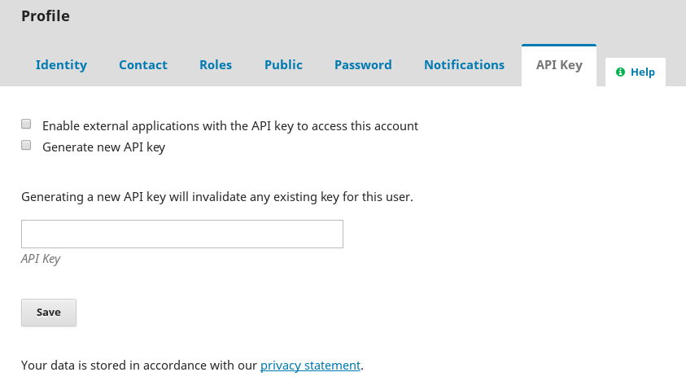

# Abonnements et utilisation d’OJS sans publication

Si vous utilisez OJS pour publier du contenu requérant un abonnement ou si vous utilisez OJS pour la gestion éditoriale sans publier, une configuration supplémentaire est nécessaire afin de permettre à Érudit d’accéder à votre contenu. Il est également requis que votre instance OJS soit à la version ​**OJS 3.1.2-1 ou plus récente**​.

**Ces étapes ne sont pas requises si vous utilisez OJS pour publier une revue en libre accès.**

## Étape 1. Créer un Responsable des abonnements

Lors de cette étape, vous allez configurer un nouvel utilisateur qui aura un rôle de Responsable des abonnements. Si le rôle de Responsable des abonnements existe déjà sur votre instance, vous pouvez utiliser ce compte et sauter cette étape. Notez que pour des raisons de sécurité, il est toutefois déconseillé d’utiliser un compte lié à un rôle autre que celui de Responsable des abonnements (il vaut mieux que ce compte n’ait qu’un rôle, celui de Responsable des abonnements). Par la suite, vous permettrez à Érudit d’utiliser ce rôle lors de la récupération du contenu de votre instance OJS en lui fournissant le ​*API key secret*​ associé à ce compte utilisateur.

Connectez-vous en tant que Directeur de la revue ou Administrateur du site, déplacez-vous sous “Utilisateurs et Rôles > Utilisateurs”. Utilisez le bouton “Ajouter un utilisateur” pour créer un nouveau compte utilisateur.

Remplissez le formulaire et appuyez sur “Sauvegarder”. Bien que nous recommandions d’utiliser des informations réelles lors de la création des utilisateurs pour votre revue, ce n’est pas obligatoire. L’important est de remplir les champs obligatoires et de vous rappeler du nom d’utilisateur et du mot de passe que vous avez utilisés pour passer à la prochaine étape.

La deuxième étape de la création d’un utilisateur consiste à lui attribuer un rôle. Dans la liste des “Rôles de l’utilisateur”, assurez-vous de cocher “Gestionnaire d’abonnement”. Sauvegardez.

Ceci complète le processus de création d’un utilisateur. Rappelez-vous du nom d’utilisateur et du mot de passe que vous avez utilisés lors de la création du compte.

## Étape 2. S’assurer d’avoir saisi un API key secret

Cette étape peut requérir l’aide de votre administrateur système puisqu’elle requiert l’accès à un fichier sur le serveur où votre instance OJS est installée.

Dans votre fichier de configuration OJS (​`config.inc.php`​ dans le répertoire d’installation de votre OJS) vous trouverez une directive appelée “`api_key_secret`​”. Par défaut, ce paramètre est vide. Si c’est le cas, modifiez-le pour qu’il contienne une séquence de 32 caractères ou plus (n’importe quelle lettres et symboles). Votre instance OJS en sera plus sécurisée lors de l’utilisation des ​*API keys​*.

Vous n’aurez pas à mémoriser la valeur de ce paramètre, mais si vous le perdez, tous ceux utilisant les ​*API keys​* (tel que celui que nous génèrerons à la prochaine étape) devront en obtenir une nouvelle.

Un coup le paramètre renseigné, sauvegardez le fichier.

## Étape 3. Générer une API Key

Déconnectez-vous de votre instance OJS et connectez-vous de nouveau en utilisant les paramètres d’accès du compte Gestionnaire d’abonnement que vous avez créé à l’étape 2.

Allez à votre Profil utilisateur (typiquement disponible dans le coin en haut à droite). Ouvrez l’onglet “​*API Key*”​:

Il pourrait y avoir déjà du contenu dans la zone “​*API Key*”​ . Si c’est le cas, ignorez-le.

Utilisez ce formulaire de la manière suivante:

1. Cochez la case “​*Enable external applications with the API key to access this account*”​.
2. Cochez la case “​*Generate new API key*”​.
3. Appuyez sur le bouton “​*Save*”​.

Ceci fait, la zone “​*API Key*​” devrait maintenant avoir une longue chaîne de lettres et chiffres. Copiez celle-ci et fournissez-la par courriel à votre contact Coalition Publica.

C’est tout ce qu’il fallait! Ces étapes permettront à Érudit d’effectuer des actions avec cet utilisateur nouvellement créé -- soit, étant donné que l’utilisateur a un rôle de Responsable des abonnements, de télécharger des contenus sous embargo (accessibles seulement par abonnement) ou non publié sur le site web OJS et par conséquent inaccessibles publiquement.