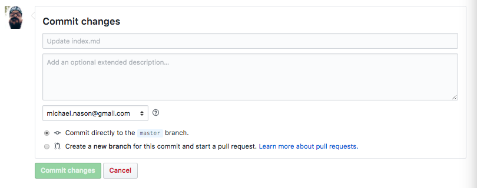

# Contributing to PKP Documentation Hub

> _This document will be improving steadily over the next week or so._

This document outlines how to contribute to/modify content in the PKP Documentation Hub. First of all, thank you in advance for your contribution! Secondly, contributing can be very easy once you know a little more about a few things.

## Markdown

All of the documents within the Documentation Hub are written in a syntax known as "Markdown". Markdown is a very simple syntax that allows users to generate basic HTML without knowing HTML language itself. Here are the two most essential guides to learning how to write Markdown.

- [Daring Fireball Markdown Syntax](https://daringfireball.net/projects/markdown/syntax)
- [Mastering Github Flavoured Markdown](https://guides.github.com/features/mastering-markdown/)

Markdown does not _require_ a specific or special editor. If you want to try writing Markdown on your own, we would recommend using [Atom](https://atom.io/) (there will be guides on setting up Atom optimally to come).

## Github

All of the documents we have are hosted in Github and – especially when looking to modify documents – it will be important to know  a little bit about repositories, branches, and pull-requests. Don't let the language intimidate you! It's pretty easy. You should be able edit a document directly from the repository itself.

1. Follow the directory structure in Github until you see the file you want to edit.
2. Click the filename to view that individual file.
3. From there, on the top right of the document window, you should see a small pencil icon.
4. Click that button to open up a plaintext editor for the document within Github itself.


### Committing

Once you've made your changes, it's time to _commit_ your changes and/or create a _pull request_. A _commit_ is simply a change to the file you are proposing to others who use the repository. You'll see two fields in the commit window.



The first, is a very succinct descriptor of what you just changed. A few words should do the trick. Here are some examples:

- updated filename.md
- migrated filename.md
- added appendix to document
- replaced images

The second window allows you to enter a more detailed description of what you changed. You might want to do this if you need to justify your changes or need to let everyone else know that a change is significant.

Below those two fields you'll see your committing options. **_If you are a member of the PKP team, you'll see the ability to commit directly to master branch_**. It's important to note that these changes will be immediate, but they will also be unreviewed. If you are making small changes to one document, it's probably fine to commit to master. If you are changing the way documents link between each other or making more broad changes to the site itself, it's recommended that you _create a new branch and start a pull request_.

### Branches and Pull Requests

A branch is a version of the repository that contains the changes you've proposed, uniquely. Since it is not part of master, it won't have an impact on the way the site is built in real-time. If you create your own branch via this method, you'll be asked to name it. It's recommended that you name it something succinct with no spaces. A good way to name your branch is with the name of the document you're adding or modifying. For example:

- crossref-doc-edits
- starting-a-journal-edits
- new-doc-filename

When you propose a new pull request, after naming your branch, you'll be asked to open a pull request. This is simply a _request you are making for the managers of the repository to pull your changes into the master version of the doc_


You can see here that you can title your request and fill out a description of what you're changed. Once you're all set you can click the link that says "create pull request". Once you do this, repository managers will be notified of your change and can decide to merge your code with the main repository.

At the bottom of the page you'll see what's known as a "diff". A diff is just a way to see what changes you've made from the original code.

### Using Github Desktop and Atom to Manage the Docs Hub

_Coming soon._

## The "Documentation Hub"

The PKP Documentation Hub utilizes Jeckyll to render our markdown files into static HTML. This isn't super relevant to the modification of documents in general, but there are some rules for our file naming, file structure, and unique syntax we'll need to know while working on our files. Chiefly, there are significant differences between _single page documents_ and _multi-page documents_.

### Single Page Docs

Single Page Documents, like this one, are rendered fully from one markdown file. The table of contents on the side of page is created using the header tags in markdown. For example,

````
## The "Documentation Hub"

### Single Page Docs
````

If you look on the left, you'll see that "The 'Documentation Hub'" is now a level 1 header and "Single Page Docs" is a level 2 header.

But, this doesn't happen by itself. When you are editing or creating a single page document, you'll need to do the following:

1. Create a folder for your document (if it's new) from the top level of the repository.
2. Name the file inside ``index.md``.
3. Place the following code at the top of the file:

```
---
generateHeadingToc: true
---
```

#### Images

_Coming soon._

### Multi-Page Docs

_Coming soon:_

- file structure
- images
- translations

## File Naming Conventions

_Coming soon._

## Modifications to Cards and Site Layout

_Coming soon._
