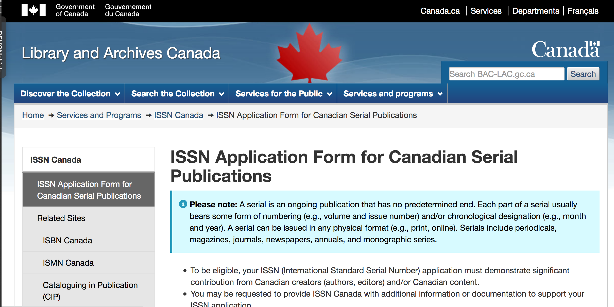
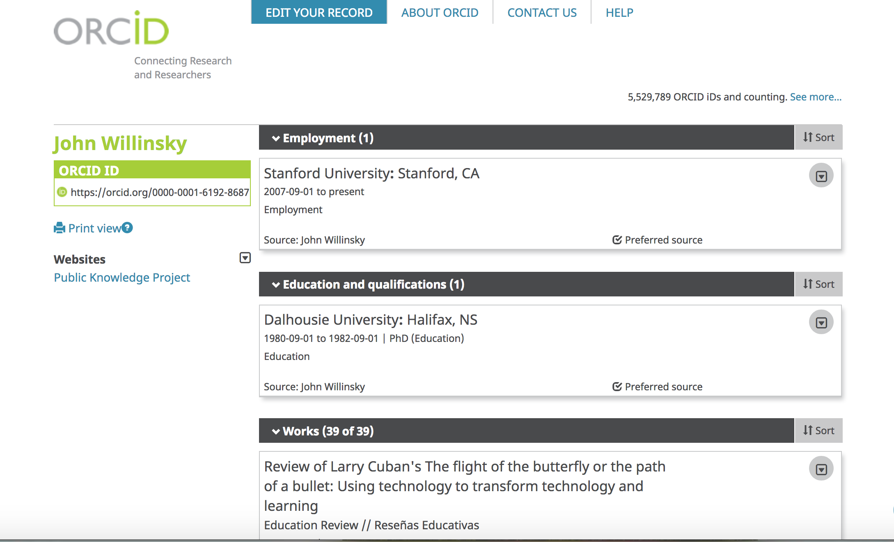
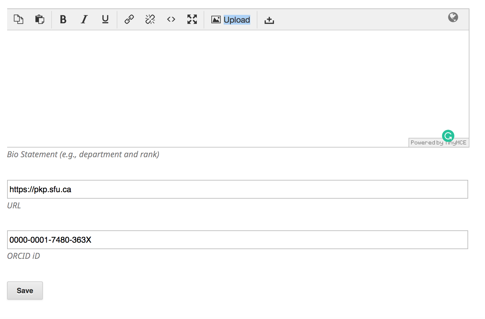
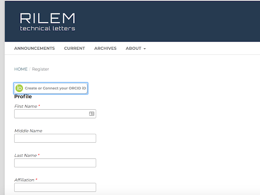

# Getting Found: Building Visibility

The success of your journal depends on developing a
regular readership, who will become part of your scholarly
community, cite your content in their own work,
and tell others about the value of your publication.
To do this, however, they will first need to be able to find you.
This section examines a variety of ways to increase the “findability‟ of your journal,
through the use of commercial indexes, open databases,
libraries, the media, professional networks, and professional recognition.

## Journal Standards and Identifiers

By Roger Gillis

There are several different standards and identifiers
that are commonly used in academic publishing,
and it is important for journal managers
to become familiar with them and the role
that they play in the operation of the journal.
Although not exhaustive, this section will cover the most important
ones: ISSN (International Standard Serial Number), Digital Object Identifier (DOI),
and ORCID (Open Researcher and Contributor ID).

### ISSNs

An important way of helping people find your journal,
and helping libraries and other organizations to make it discoverable, is to obtain an
International Standard Serial Number (ISSN). An ISSN is an eight digit,
international standard, which allows for any serial publication (i.e. any publication
that is published on a repeating or “serial”  basis -- journal, magazine, etc.) regardless
 of where it is published, the medium, language, or frequency of publication.
ISSNs are widely used by libraries, citation indexes, and the publishing industry to
uniquely identify and distinguish journals. They are often more important than the journal
title itself for serials management because they provide a consistent identifier throughout
the life of a journal. Even if the journal changes names, the ISSN remains the same. This is essential
for organizations like libraries and indexes to be able to identify and distinguish your journal.
Many external services, including indexing services, such as the [Directory of Open Access Journals](https://doaj.org), require that journals have an ISSN.
A ISSN can be obtained free of charge from a [local ISSN Centre](http://www.issn.org/services/requesting-an-issn/).

_An example of an ISSN application from Library and Archives Canada_

ISSNs should be displayed on the journal’s website where it can be easily located, such as the footer or sidebar. If the publication has both a print and online edition, there is typically one for each. In OJS, you will be asked to enter your ISSN as part of the Journal Settings. This is used for metadata purposes and is not shown to readers. To make the ISSN visible in the journal footer, type it into the footer text field in the Website Settings. To make is visible in the sidebar, create a custom block.

For the final published version of an article (i.e., a PDF galley), you may also want to include the ISSN, along with the journal name and DOI (see below), on the final page or in the footer of the PDF of the article itself. This is important, as PDFs can be downloaded, shared via email, and become disassociated with the journal. You always want to provide an easy and obvious link back to your journal.

### Digital Object Identifiers (DOIs)
The Digital Object Identifier or DOI is used to individually identify unique content. They are typically applied to journal articles, but can be used for other content types such as datasets, images, or other supplementary materials added alongside articles. DOIs are what are called “persistent identifiers” -- so even if the URL (Uniform Resource Locator - in other words, a website link) for a journal changes, the DOI remains the same and can be used to link to an article. DOIs are becoming increasingly common and their use is seen as an indicator of the professionalism of the journal, so it is important to take them seriously.

#### The anatomy of a DOI
A DOI consists of a series of characters divided into two parts -- a prefix and a suffix, which are separated by a slash. The prefix uniquely identifies the registrant (i.e. the publisher) of the title, and the suffix identifies the specific object. So, for example:

For, example, this article: [“Health Care Professionals’ Opinions and Expectations of Clinical Pharamacy Services on a Surgical Ward”](http://www.cjhp-online.ca/index.php/cjhp/article/view/1606)

The DOI in this case is  10.4212/cjhp.v69i6.1606

The “10.” part of the prefix identifies the DOI registry - the agency that issues the DOI numbers, in this example, Crossref. The characters “4212” in the prefix identify the registrant - in this case, the publisher: Multimed. And the cjhp.v69i6.1606, the suffix, consists of several different parts, meant to distinguish the particular content:

“cjhp” --  is an abbreviation for the journal -- The Canadian Journal of Hospital Pharmacy. This is a common feature of DOIs, where a journal will opt to be identified in a DOI by a standardized journal abbreviation. Multimed publishes multiple journals, and this helps to identify to which of its titles this article belongs.

“v69i6.1606” - is the volume number of the article (69), then the issue number (6), and finally “1606” is a unique identifier for the individual article. For journals using OJS, the DOI will be automatically generated for each article.

DOIs are capable of identifying a journal, an individual issue or volume of a journal, an individual article in a journal, or can even go so granular as to identify a table or chart in a particular article. Not all journals use an abbreviation as part of the suffix. Many use a random number that is assigned by a DOI registration agency. However, using a journal abbreviation is a good way of allowing users to more quickly identify your journal.

You may often see DOIs communicated as URLs: “https://dx.doi.org/10.4212/cjhp.v69i6.1606”. This method can be used to obtain any article that has a DOI, by indicating the DOI following the “dx.doi.org”.

#### Setting up DOIs in OJS
Journals publishing with OJS will find it very easy to work with DOIs. However, some initial setup steps are required. First, you will need to register with [Crossref](https://www.crossref.org/membership/), which does require an annual fee. Further integration regarding OJS’ integration with Crossref can be found in the [Crossref manual](http://docs.pkp.sfu.ca/crossref/). You will then need to enable the DOI plugin within the OJS Journal Settings. Using [DOIs and the DOI plugin](http://docs.pkp.sfu.ca/dois/) provides you with the detailed steps you need to follow to configure DOIs for OJS.

#### Registering your DOIs in OJS

Once you have joined Crossref and configured OJS to use DOIs, you will need to register your content as it is published. Again, OJS can help you with this, and the steps are outlined in the [Crossref manual]((http://docs.pkp.sfu.ca/crossref/).

### Open Researcher and Contributor ID (ORCID)

The Open Research and Contributor ID (ORCID) is a persistent digital identifier that distinguishes one researcher or contributor from another, and is being increasingly adopted in workflows for grant and publication submission. The ORCID also serves as a means of ensuring that a researcher is accurately identified as a contributor for a particular work. This is particularly useful when authors have the same names. ORCID also ensures that works are properly attributed to authors who have undergone a legal name change.

An ORCID can be obtained by any researcher by [registering on the ORCID website](https://orcid.org/register). Registering for an ORCID is free, and filling out a basic profile takes just a few minutes.

Here’s an example of an ORCID profile: http://orcid.org/0000-0001-6192-8687 for researcher and PKP Director John Willinsky.

ORCID adoption is increasingly becoming a requirement among journal publishers and funders and many systems are using ORCIDs as a way to easily integrate author and/or contributor information into online submission forms. By identifying yourself with your ORCID in filling out a grant submission or manuscript submission form, the system that you’re entering can easily pull in all of the information contained in your ORCID profile into the registration form.

Note |
------------ |
Having a public profile also lends credibility to a researcher, allowing them to specify their education, employment, as well as published works in one central location. It also lends credibility to the journal, such as when you include the ORCID numbers for each of your editorial team members on your website. It is a valuable way to demonstrate that there are real people associated with your journal, not a list of made up names (which is seen as a sign of being a “predatory” journal).  |  

Journal managers can encourage the use of ORCIDs by authors as a means of effectively collecting up-to-date information. While it might not be appropriate to enforce the use of ORCIDs, as not all authors will have them, it could be suggested to authors that they obtain an ORCID as part of the submission process and be required upon acceptance. This information, including a link to the ORCID registration form, could be part of the journal’s submission policy and featured on the journal’s website.

For journals using OJS, the ORCID can be entered as part of a user profile (under “Public” in OJS 3):

The OJS registration page can also include the option for new users to use their ORCID when registering:

This will automatically pull their personal data (first name, last name, email, etc.) from the ORCID database into the OJS registration form.

#### Further Reading:
Library Publishing Coalition(LPC) Webinar Series: [ORCID in Publishing Workflows](https://www.youtube.com/watch?v=9A3sk13C7QM)

### Metadata

Coming later.
