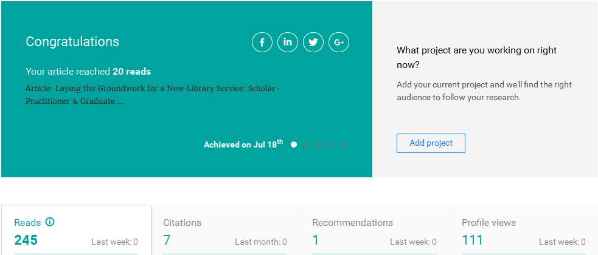
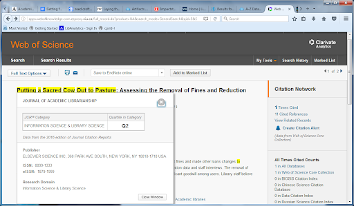
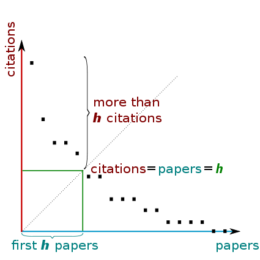
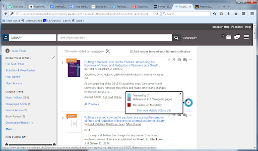
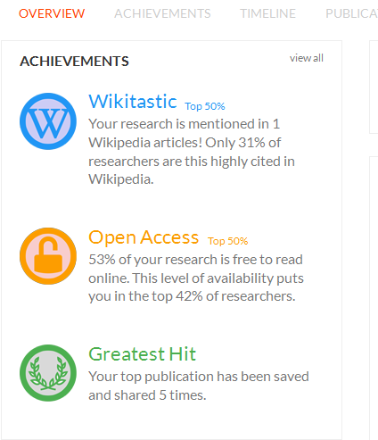
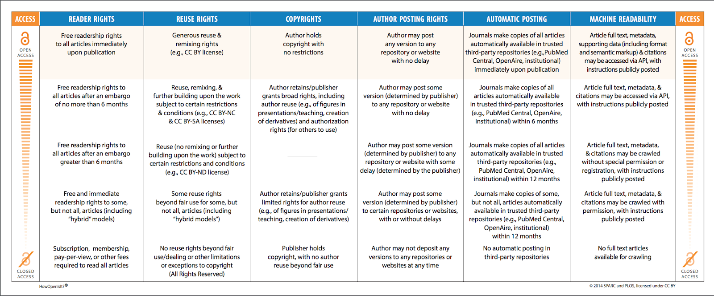

# Increasing Impact

Another method of building professional recognition is through the use of different techniques for measuring the use and impact of your journal. This will provide clear evidence of the success of your journal and allow you to regularly evaluate your progress.
Under the traditional subscription/print model, the number of subscribers often formed the basis for understanding the usage of an individual journal. For open access journals, without a subscriber base to point to, this can be a challenge. OJS, however, does provide the option of requiring readers to register. A fee is not necessarily required for this registration, but does allow the journal to develop a better understanding of its audience. Some statistical analysis and reports are available to the OJS Journal Manager, including reporting on the number of registered users. The reporting and statistics capabilities of OJS are available in the [OJS statistics documentation](https://docs.pkp.sfu.ca/admin-guide/en/statistics).

Perhaps more important than the question of how many people are accessing your journal is how they are using it. This is known as measuring the “impact” of your journal. Journals with high citation impact are among the most respected and successful academic journals in their fields. Citation impact refers to how often an article, an author, or a journal is cited by other scholars. While this is not an uncontroversial means of measuring the value a journal is having in the academic community, it is the standard one that most people recognize and operate on the basis of. Readers looking for reliable information will often first look to journals with a high citation impact. Prospective authors, reviewers, and editors will be interested in volunteering their time with journals that have a high citation impact. Indexes and databases will want to include journals in their resources that have a high citation impact. And lastly, libraries will be motivated to promote journals with a high citation impact. All of this can lead to a cyclical pattern, where high impact journals are more likely to be used and supported, leading to more recognition, and higher impact. The challenge for every new journal is to get this process started, using some of the methods discussed in the previous section.

Of particular interest for OJS and other open access journals are the results from several studies revealing that open access policies tend to increase the citation impact of journals (“Bibliography of Empirical Studies on Open Access”, 2006). By providing free and immediate access to their content, open access journals are increasingly becoming the first choice among scholars for their research.

## Attracting Authors

Growing the number of authors that are contributing to your journal is an important element of growing your journal and ensuring that it continues to produce quality contents. Consider ways of drawing attention to your journal/publication by advertising it as part of conferences, posting the publishing of new issues to relevant listservs, or through departments at universities that have a research focus in the area that your journal publishes in.

It’s important to note that mass solicitation or “spamming” of authors is often viewed as a problematic practice in some circles and one that has been employed by questionable publishers. Try to strike a balance between actively soliciting for publications and inundating potential authors with this solicitation.

## Commercial scholarly networking platforms

> Contributed by Dana MacFarland

Commercial platforms such as ResearchGate and Academia.edu offer various services for authors that may include the following:

* Indexing in search engines (e.g. Google Scholar)
* Publication alerts
* Ability to create a profile on the platform
* Ability to contact other scholars through the platform
* Ability to host files and distribute them through the platform and track their use
* Promotion of jobs and other opportunities
* Metrics or indicators per article or for the author

In advising authors about such services, it is important to be aware of the terms of use, which are typically subject to modification without prior consent and at the sole discretion of the service provider.

For example:
* [Academia.edu](https://academia.edu)
* [ResearchGate](https://researchgate.org)

*Screenshot from ResearchGate*

Features of scholarly networking platforms may appeal to authors, but there are implications, particularly in hosting versions outside of OJS, that journal managers should be aware of. These include the following:

*Aggregating metrics*:  When a work may be retrieved from multiple platforms, indicators of use will also be distributed among those platforms. This may drive traffic to content published by a journal, but perhaps not exclusively via the journal platform. Journal managers should consider workflows or tools to aggregate and understand broader patterns of use related to articles that they publish. Counting downloads will not adequately represent use if a community of scholars around a journal also values the ability to upload a version to ResearchGate, or even to their institutional repository. 

To address this, DOIs facilitate aggregation of metrics across platforms, through tools such as ImpactStory, Altmetric, and PlumAnalytics. In practice, effectiveness of these tools varies based on the breadth of relationships that they are able to establish with publishing platforms and none is comprehensive. For instance, none to date include indicators of use via ResearchGate or Academia.edu. Also, some platforms will assign another DOI when a version is uploaded to their site. Consequently and counter-intuitively, it may be productive to track more than one DOI per item.

Manual collection is another strategy that might be adopted i.e. gathering download counts that include sampling from commercial platforms, perhaps using Google Analytics to identify referring sites.

*Understanding use*:  Where other hosting of articles is occurring, consider how the metrics on other platforms are derived and how they might be understood. (e.g. ResearchGate offers reads, citations, recommendations, score.)

## Research Impact Metrics

Contributed by Ali Moore and Jennifer Chan

### What are bibliometrics?

Bibliometrics are “the use of mathematical and statistical methods to study and identify patterns in the usage of materials and services within a library or to analyze the historical development of a specific body of literature, especially its authorship, publication, and use,” [(Reitz, 2004)](http://www.abc-clio.com/ODLIS/odlis_b.aspx.). Bibliometrics are a method of interpreting and evaluating the quality of an article, journal, or the body of an author’s work. Bibliometrics are frequently used as an indicator of an author’s productivity and impact in tenure and performance review processes, and/or to obtain or to demonstrate accountability for grant-funded research. Applying metrics in such a manner is not without controversy and critics suggest that these measures are poor proxies for determining true academic impact. In some instances, the quality of the publication, assessed via the calculation of a Journal Impact Factor (JIF), is interpolated to assess the quality of a single article within the publication, or even used to assess the quality of the article’s author, [(Callaway, 2016)](http://www.nature.com/news/beat-it-impact-factor-publishing-elite-turns-against-controversial-metric-1.20224.).
Editors should be aware that a variety of metrics may be considered by prospective authors in arriving at their decision of whether or not to publish in a given journal. A general understanding of this subject may help editors to address author concerns. Bibliometrics, impact factors, and other indicators can usually be divided into one of the following categories: journal-level, article-level, or author-specific. Some of these metrics are discussed in the section below.

### Journal-level metrics

#### Journal Impact Factor

One of the most well-known and well-established journal-level metrics is the journal impact factor (JIF). JIF is measured as “the frequency with which the 'average article' published in a journal has been cited in a particular year. It measures a journal's relative importance as it compares to other journals in the same field” [(SFU Library, 2017)](http://www.lib.sfu.ca/help/publish/scholarly-publishing/scholarly-metrics). You can find a journal’s impact factor in Journal Citation Reports, which is published by Thomson Reuters.

Journal Impact Factor, and 5-year Journal Impact Factor can be calculated using the formulae below:

JIF is considered a fairly controversial measure, as the number of open access journals, books, conference proceedings, and items in languages other than English included in the Journal Citation Reports is very limited. JIF also does not take into account self-citing. [Additionally, articles may be highly cited for negative reasons; as such, a high impact factor is not necessarily a guarantee of quality.]

### Eigenfactor score

A journal’s Eigenfactor score is evaluated based on the number of “The Eigenfactor ranks journals based on the number of citations its articles receive, weighting citations that come from other influential journals more heavily. A benefit of the Eigenfactor over the JIF is that it excludes self-citations.

The Article Influence score is the Eigenfactor divided by the number of articles in the journal. This metric is most directly comparable to the JIF.”

### Journal Immediacy Index

The journal immediacy index measures how frequently the average article from a journal is cited within a given year of publication. This metric is made available through the InCites Journal Citation Reports (JCR) tool, but the formula could be applied to any journal that has compiled citation data for a given year. To calculate the immediacy index for a journal, the following calculation is applied:

immediacy index for year x = total number of citations for reviews and articles accrued in year x  / total number of reviews and articles published in year x

InCites JCR claims that the immediacy index allows one to see how quickly an article published in a given journal is cited relative to others in its subject category, which helps to identify which journals are publishing the “hottest” papers in a discipline.

One can quickly see that there are a number of challenges with such an assertion. Firstly, journals gearing to publish issues earlier in the calendar year will benefit from a higher immediacy index as their outputs will have enjoyed a longer period within which to glean additional citations. Secondly, because it is a per-article average, the immediacy index tends to discount the advantage of large journals over small ones.

### Article-level metrics

#### Citation count

On the most basic level, individual articles are evaluated based on the number of citations that they receive. While a higher number may indicate that the article points to an original, innovative, or historically significant article, that is not necessarily the case: a study that is notoriously problematic may also be frequently cited as an example of what ought not to be done.

Citation counts are also very discipline specific. Health science researchers, for example, produce a higher volume of research outputs in particular formats such as journals than those working in the humanities or contemporary arts. As such, citation counts should not be compared across disciplines; a “highly cited” paper in one discipline may have thousands of citations, while another may have a couple hundred, and each paper may be considered highly cited in its own field.

A number of different databases track citation counts, including Google Scholar, IEEE Xplore, PLOS One, Scopus, and Web of Science. Citation counts will vary among these because while there is overlap among coverage, each also ranks and analyzes unique journal titles.

For example, citation count in Web of Science citation counts are limited to those journals selected for inclusion in their database.



For the same example, Google Scholar returns a higher citation count because the index is more inclusive, and also represents non-journal citations.

#### Article Influence score

“The *Article Influence Score* determines the average influence of a journal's articles over the first five years after publication.  It is calculated  by multiplying the Eigenfactor Score by 0.01 and dividing by the number of articles in the journal, normalized as a fraction of all articles in all publications.  This measure is roughly analogous to the *5-Year Journal Impact Factor* in that it is a ratio of a journal’s citation influence to the size of the journal’s article contribution over a period of five years” [(Clarivate Analytics, n.d., emphasis in original)](http://ipscience-help.thomsonreuters.com/incitesLiveJCR/glossaryAZgroup/g7/7751-TRS.html)

#### Immediacy Index

The immediacy index is not calculated at the article level as it takes into account the total number of citations received for articles and reviews published by a given journal for a particular year. As such, it is only calculated at the journal level.

#### Download Count

In addition to journal specific metrics, many publishers, both commercial and open access, also provide article download counts as a quantifiable measure of article attention.

### Author-specific metrics
#### *h*-index

The *h*-index differs from other types of publication metrics in that it is aimed at demonstrating an author’s productivity and citation frequency across their body of work as a whole rather than focusing on a single publication. *h*-index is sometimes referred to as the *Hirsch index* or *Hirsch number* because the index was first suggested by University of California, San Diego physicist Jorge E. Hirsch as a metric for evaluating output in theoretical physics. Hirsch criticized journal impact factor (IF) and citation counts as being poor measures for researcher quality, [(McDonald, 2005)](http://ucsdnews.ucsd.edu/archive/newsrel/science/MCH.asp).

The *h*-index takes into account both the number of publications of a given author, as well as the number of citations per each publication.

(Image Source: [Wikimedia](Image Source: https://upload.wikimedia.org/wikipedia/commons/thumb/d/da/H-index-en.svg/425px-H-index-en.svg.png) (Public Domain)

#### Limitations of h-index

It should be noted that *h*-index numbers of researchers should only be compared for those working within the same discipline. The value of *h*-indexes of authors working across different disciplines should not be directly compared because the method of computing the index strongly reflects differences in publication frequency, resulting in a lower value for researchers working within disciplines where lower publication frequency is the norm [(Bornmann, 2008)](http://www.emeraldinsight.com/doi/abs/10.1108/00220410810844150). *h*-index also does not reflect order of authorship listings, which is an important consideration in some academic disciplines. The *h*-index calculation results in a natural number and therefore has been criticized as having less discriminatory power than other methods of calculating research impact.

The reliance of the *h*-index upon the corpus of an author’s works can result in differing values when calculations do not take into account the same publication sources. This discrepancy, documented in “Which *h*-index? — A comparison of Web of Science, Scopus and Google Scholar,” demonstrated that *h*-index values could vary from database to database, [(Bar-Ilan, 2007)](https://link.springer.com/article/10.1007%2Fs11192-008-0216-y]. For instance, if one calculation takes conference proceedings into account as a valid part of the author’s body of work, the *h*-index will necessarily result in a different value than when calculated without that category of content. Therefore, the publication in which a work appears must be indexed by the database in question in order to be reflected in this calculation.

### Altmetrics

The term “altmetrics,” originally a portmanteau of “alternative” and “metrics,” refers to emerging metrics based on the social web, [(Priem, 2010)](http://altmetrics.org/manifesto) describing a range of non-traditional indicators that relate to the attention and/or use of published scholarly information (mentions in social media, social bookmarking, likes, etc.). One criticism levied at conventional bibliometrics is that the ability to measure attention is considerably delayed when metrics are reliant upon citations, a phenomenon often referred to as “citation lag,” [(Nakamura, 2011)](https://link.springer.com/article/10.1007/s11192-011-0341-x). Altmetrics tools relying on the social web can provide much more timely, near real-time usage/attention data, and may be applied to both traditional and non-traditional publishing formats.

With growing awareness, more nuanced understandings have characterized alt- or “all-metrics,” or “influmetrics,” as features of the evolving landscape of scholarly communication that do not replace but rather extend and complement more familiar indicators of use and influence [(Reed, McFarland, Croft 2016)](https://journals.library.ualberta.ca/eblip/index.php/EBLIP/article/view/27301). While traditional measures of impact related to journal publishing (impact, citation counts) remain important to critically assessing influence of a journal and the articles in it, altmetrics offer journal managers insight into conversations or activity in venues that would otherwise be opaque.

For example, [ImpactStory](https://impactstory.org), [Altmetric](https://altmetric.com), [Plum Analytics](https://plumanalytics.com) and others use persistent identifiers such as DOIs to aggregate mentions of articles not just in citation indexes, but also in Wikipedia, Twitter, Mendeley and other online venues.

ImpactStory also indicates the proportion of the work that appears to be available from Open Access platforms.

These features, which may demonstrate influence, use, and accessibility beyond the academic environment, may be of particular interest to journals that are grant-funded.

Further Reading:
[Metrics Toolkit](http://www.metrics-toolkit.org/)

## Library Catalogues and Link Resolvers

> Contributed by Sonya Betz

Libraries have historically been the primary access point for most academic journals. Although researchers now find open access articles from other sources, there are still many who use traditional library systems to find relevant articles. A journal’s inclusion in tools such as library catalogues and link resolvers can help boost the profile of the journal, provide access to the journal’s content for other automated applications, and improve perceptions of the journal’s credibility.

### Library/Union Catalogues

If the journal has a local library affiliation, then editors can work with the library to catalogue the journal and make the record available in WorldCat (the world’s largest library catalog, which features library holdings from all over the world) for copy cataloguing by other libraries around the world. For example, WorldCat provides the Digital Collection Gateway tool:

>“The WorldCat Digital Collection Gateway provides you with a self-service tool, available at no charge, for harvesting the metadata of your unique, open-access digital content into WorldCat. Once there, your collections are more visible and discoverable to end users who search WorldCat as well as Google and other popular websites.”

  Source: [OCLC](https://www.oclc.org/en/digital-gateway.html)

Using tools like WorldCat Digital collection gateway, which is typically used by libraries to provide access to Open Access resources, can be a great way of providing exposure for your journal. If configured appropriately, a journal article’s metadata will be displayed as records in search results. Your local library may be able to help you to get material included in Digital Collection Gateway.

You can approach aggregators and indexing services for inclusion into their respective databases. These databases subsequently form part of the presentation layer for web scale discovery systems such as Primo and Summon made available to users of library catalogues.

### Link resolvers

Link resolvers enable databases to connect to full-text journal articles. If a journal is indexed by another source, such as the DOAJ, or a commercial indexing service, then the journal may be included in link resolvers’ knowledge base as a source of full-text content. If not, journals can work with a local library to provide records.

## Copyright and Licensing

> Contributed by Roger Gillis

Copyright and licensing impacts your journals ability to have its content found and used. How you claim ownership as a publication over the material you publish will affect users’ ability to share and distribute that content outside of your website. For example, do you allow authors to retain copyright and distribute their articles outside of the journal such as by depositing a copy in their institutional repository, or on an author’s personal website? These are important considerations -- allowing authors to share their work that is published in your journal outside of your journal has the potential to help authors fulfill Open Access funding requirements and help them showcase and share their work (as well as raise the profile of your publication). It is important to drive readers to your journal website, but it may not always be possible for readers to read your journals’ content solely on your website, especially as authors increasingly wish to take advantage of other venues for sharing their work.

While many journals claim to be “Open Access,” there are many degrees of what is considered “Open”. The Scholarly Publishing and Academic Resources Coalition (SPARC)  provides a good overview of the six fundamental aspects of Open Access -- reader rights, reuse rights, copyrights, author posting rights, automatic posting, and machine readability -- all of which factor into what journals need to consider as a part of their Open Access and Copyright policies.

Source: [Scholarly Publishing and Academic Resources Coalition “How open is it”](https://sparcopen.org/our-work/howopenisit/). Licensed under CC-BY.

Developing copyright and licensing policies that address all of these criteria can be very helpful to authors and letting them know what the journal does and does not permit with respect to the articles and other material that are published as part of the journal or publication. The Open Access Scholarly Publishing Association (OASPA) provides some advice on how and where copyright and licensing policies should be articulated:

>“Licensing policies should be clearly stated and visible on journal websites and all published material. Policies are often >stated at the bottom of each page of a website, but should also be clearly set out in an additional ‘Terms of Use’ or >‘Policies’ section, or in Guidelines for Authors.” 
(Source: Open Access, Scholarly Publishers association, 2016 [“Best practices in licensing and attribution: What you need to know.](https://oaspa.org/best-practices-licensing-attribution-need-to-know/))”

### Copyright Ownership

One consideration that publishers will have to make is who owns the copyright of the material being published. Traditionally, in commercial publishing, publishers have insisted on owning copyright and having authors transfer the copyright to them. Increasingly, however, this is beginning to change, with many authors wanting to retain the copyright to their works in order to disseminate them in different venues (e.g. institutional repositories, personal websites, or as derivative works). Often, this is done with the requirement that when distributing outside of site, that authors ensure that they provide an appropriate citation and/or link to the original work on the publishers’ website, which can serve to increase readership in a journal. The copyright ownership policy that a publisher decides on should clearly articulate who owns the rights to a work that is being published, and -- if the author retains rights -- which rights these include. Sometimes these rights include the rights to use works for particular purposes (e.g. having copies of the work on a personal or university website). Or, in other instances, the author may retain copyright entirely, and is free to use their work as they wish.  Less restrictive licensing whereby authors either own the copyright or the work is licensed under a Creative Commons license (see below for more information on Creative Commons licenses) tend to be the norm for Open Access publishers and authors have come to expect. Moreover, allowing works to be disseminated outside of the publishers’ website can increase the distribution of the works themselves, thus increasing the availability and readership of the journal.

### Creative Commons Licenses

Another way that you can make your policy on sharing your journal/publication’s content explicit is through the use of Creative Commons licenses. There are different types of Creative Commons licenses, which stipulate that the material being licensed allows different uses. Creative Commons licenses are widely used on a variety of web-based material ranging from photographs, video and sound recordings, as well as written works such as books and articles. As of 2017, there are over 1.4 billion works that are licensed using Creative Commons licenses [(Creative Commons, 2017](https://stateof.creativecommons.org/).

Creative Commons licenses have a number of benefits, one of which is making it clear to users’ how the creator and/or publisher wish for the material to be used (e.g. whether it can be used commercially, whether derivative copies can be made, etc.). Another advantage, is that Creative Commons licenses are machine-readable, meaning that search engines and other technology  are easily able to read and interpret Creative Commons licenses and inform users about the licensing attached to each individual work.

In OJS, you can specify the use of Creative Commons licenses as part of the setup process, selecting the license which you wish to accompany each individual article that is published. The following graphic provides an overview of the various types of Creative Commons Licenses and the uses that they allow:

Source: [University of British Columbia Libraries](http://guides.library.ubc.ca/c.php?g=698822&p=4961441#s-lib-ctab-15605828-2). Licensed under a CC-BY license.

### SHERPA/RoMEO

Journals and publishers should also consider sharing relevant policies as part of the [SHERPA/RoMEO database](http://www.sherpa.ac.uk/romeo/index.php)

SHERPA/RoMEO is a popular database used for sharing journals’ and publishers’ policies on copyright and licensing of their works. It is used by authors, libraries, funders, as well as others to determine if publishers allow sharing of their publications outside of their website. Making this explicit through your policy and including your policies in a database like SHERPA/RoMEO can make it clearer for authors and users of of journals and publishers’ content on specifically how they  are allowing their publications to be used and share.

## Further Reading:

[Open Access Publishers Association - Best Practices in Licensing and Attribution](https://oaspa.org/best-practices-licensing-attribution-need-to-know/)
