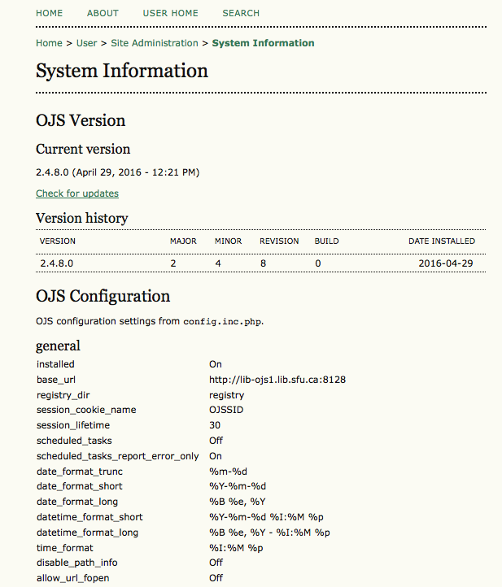

# Administrative Functions

### System Information

To access detailed system information, from the Site Administration page, under the Administrative Functions menu, click the **System Information** link.

  

  

  
  
OJS Version information shows which version is currently installed, and your version history including any upgrades. You can click the **Check for updates** link to see if you are using the most recent version of OJS.

The OJS Configuration section displays all of the configuration options and their values as they are in config.inc.php. You can find more information about config.inc.php configuration parameters in the file itself.

The final section on this page displays server information: your operating system, PHP version, server and database information. You can also view extended PHP information by clicking the **Extended PHP information** link (this displays the output of [phpinfo()](http://ca.php.net/phpinfo)). All of this information can be useful when trying to troubleshoot a problem.

### Sessions and Caches

The Site Administrator has a final few administrative tools available: the Expire User Sessions, Clear Data Caches, Clear Template Cache options, Clear Scheduled Task Execution Logs, as well as the Merge Users feature (described below).

Clicking the **Expire User Sessions** clears all active user sessions in the system, requiring any user that is currently logged in to sign in to the system again.

Clicking the **Clear Data Caches** link clears all cached data, including locale information, help cache, and search cache. This function may be useful to force data to be reloaded after customizations have been made.

Clicking the **Clear Template Cache** link clears all cached versions of HTML templates. This function may be useful to force templates to be reloaded after customizations have been made.

If scheduled tasks have been enabled for your journal, clicking the **Clear Scheduled Task Execution Logs** will delete the task execution log files from your server. The execution log files include dates that correspond to previously completed scheduled tasks (e.g. sending automatic email review reminders).

### Merging Users

This page allows you to merge two or more user accounts into one, handy if a user has accidentally created two accounts, or if you have unused or spam accounts in your system. The first selected account will be subsumed into the second account. The Site Administrator can merge users across the whole site; Journal Managers can also merge users, but only those enrolled with their journal. Comprehensive information on merging users can be found in [Chapter 5: Journal Management](https://pkp.gitbooks.io/learning-ojs-2/content/en/merge_users.html).
