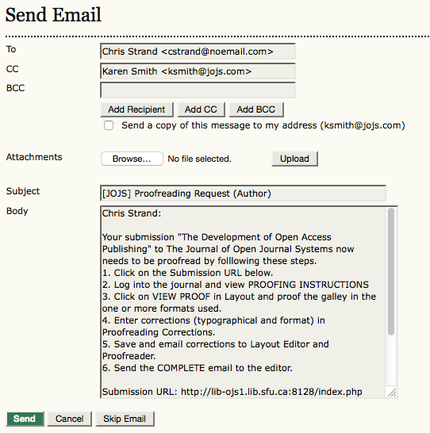
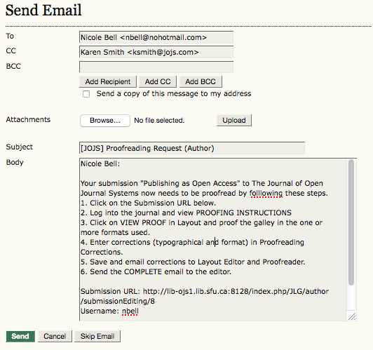

# Proofreading

## The Section Editor as Proofreader Process

Now that the galleys have been created and uploaded into OJS, the next step will be to proofread those files, to ensure that no errors exist before publication.

The journal has two options for the proofreading process. The Journal Manager can choose to have the Editor or Section Editor act as the Proofreader or allow the Editor or Section Editor to select a separate Proofreader.

If you as the Section Editor are acting as Proofreader, follow these steps:

* First, request that the Author undertake the proofreading of the galley using the Request icon:

* This will generate an email message for the author. Hit the Send button to deliver this email:

* Once the Author has completed their review, use the Acknowledge icon to thank them for their work. Use the Proofreading Corrections icon to view any comments made by the Author. You can optionally use the **Initiate** link to indicate that you have begun your proofreading responsibilities for this submission. Alternatively, you could simply revise the galleys and upload them in the Layout section using the Edit link for each galley.

* Make any required changes to the galleys, and upload them as Layout Versions in the Layout section. Hit the **Complete** link when finished.

* As the final step, select the **Initiate** link to indicate that you have started the Layout Editor proofing (again, this is optional and may not be required for your journal's workflow).

* Download the corrected Layout Versions, make any final changes, upload as revised galleys, and hit the Complete link to indicate that you have finished your proofreading.

  

* Repeat these editorial steps for each submission. Once you have scheduled all of the submissions to the issue, you can [Publish](https://docs.pkp.sfu.ca/learning-ojs-2/en/issues) the issue and make it available on your journal web site.

## The Separate Proofreader Process

As the Section Editor, once you have been notified by the Layout Editor of the completion of the galleys, select a Proofreader.

Select a Proofreader from the resulting list using the Assign link. If no Proofreaders are listed, contact the Journal Manager to enroll someone in this role.

The Section Editor then sends the Request email to the Author to begin the Proofreading process using the Request icon.

  

This will generate an email message, which includes detailed instructions for the Author.

You and the Proofreader will receive an email from the Author when they has completed their proofreading. You can use the Acknowledge icon to thank them for their work.

The Author, upon completing their review of the galleys and Supplementary Files, if any, sends a completion email to the Proofreader, with a CC to the Section Editor. Any typos or formatting errors are noted in the Corrections text-box in Proofreading (because the Authors and Proofreaders cannot mark up the galleys).

The Proofreader, on completing the review of the galleys and Supplementary Files, if any, notifies the Layout Editor, with a CC to the Section Editor, and the Layout Editor proceeds to correct the galleys and Supplementary Files, if any.

Finally, The Layout Editor will notify you that the submission is ready to be scheduled for publication. Use the Acknowledge icons to thank them for their work.

At this point, you may again wish to review the files, and if satisfied, schedule the submission for publication by choosing an issue under Scheduling, and pressing Record. The submission's galley files will then be available for readers when the issue is published.