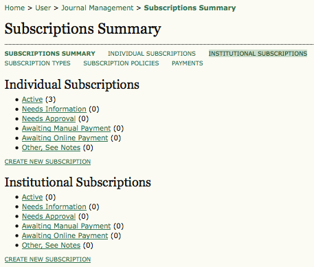
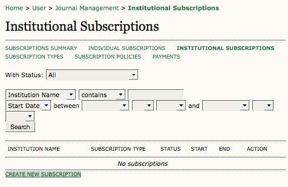
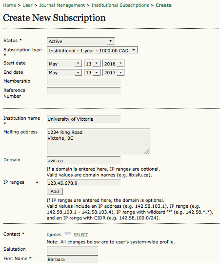

# Institutional Subscriptions

Institutional Subscriptions differ from Individual Subscriptions in a number of important ways. Obviously, one is for entire institutions and the other is just for single users. Individual Subscribers access the content of your journal by logging in with their username and password. Institutional Subscribers, however, will access the content on a computer from a recognized IP address or domain. No logging in is required for these institutional readers.

From the Subscriptions Summary page, Select **Institutional Subscriptions** to configure or manage institutional subscriptions.

On the resulting page, you can view/edit any existing **Institutional Subscriptions**, or use the **Create New Subscription** link to create a new one.  

In the same way as in Individual Subscriptions, you will have the option to select from a list of existing users. Institutional Subscriptions cover entire organizations, but still must be *owned* by an individual account holder from your journal.

  

If there is no current account holder, use **Create New User** to make one. This will open the same New User form seen previously. The form will be filled in with information about the representative from the institution (often a librarian).

Once completed, this new user can then be selected as a new institutional subscriber.

  

Click their Select link and fill in the resulting form to **Create New Subscription**. This information includes the domain and IP information (this is what will allow readers from that institution to access your content with logging in). If you are unsure what the IP range is, the contact should be able to tell you.

