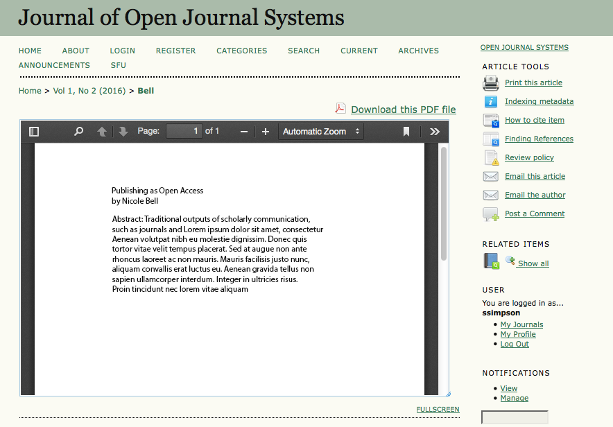

# Reading Tools

Reading Tools are intended to assist both expert and novice readers of the journal in building a context for interpreting, evaluating and utilizing the research they are reading.

Reading Tools have been developed for a wide range of academic disciplines and the Journal Manager can select, as well as update and edit these tools to support the journal's reading environment. 

The Tools are displayed in the user's browser to the right of the item being read.

  
Reading Tools provide Readers with access to things like an item's indexing information, a print version and a citation. The Tools also enable Readers to look up words in the item (by double clicking on any work in the HTML version of the item); to email the author, share the article with another Reader; or to comment on the article. All of these features create a much more interactive reading environment. 

The Tools are also designed to take the first two keywords from the submission and feed them into search engines of open access databases and other resources. These features are found under the heading Related Items, and are grouped under Author's Work, Media reports, Government Websites, Teaching files, Online Forums, and other categories, depending on the set of Tools selected.

In each category the Tools provide multiple choices or databases to consult, while allowing the Reader to learn more about each database by providing a link to an About page for the resource. (The Journal Manager is able to edit or delete existing resources and add new ones as well – see the Journal Management section regarding Reading Tools for details.)