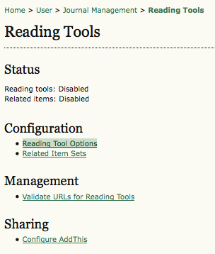
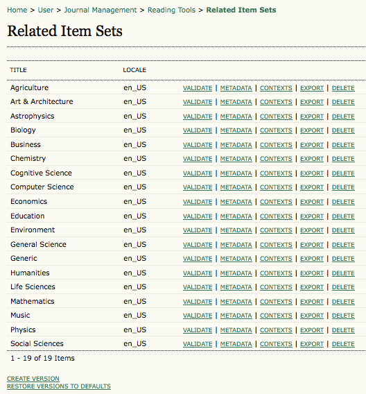
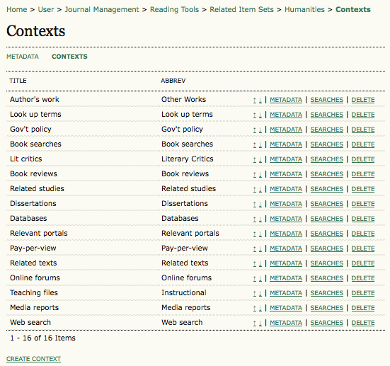
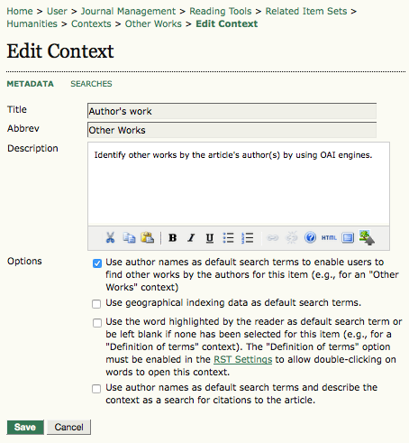
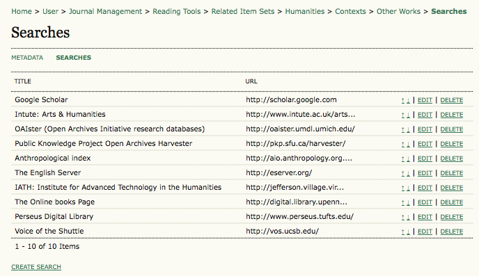
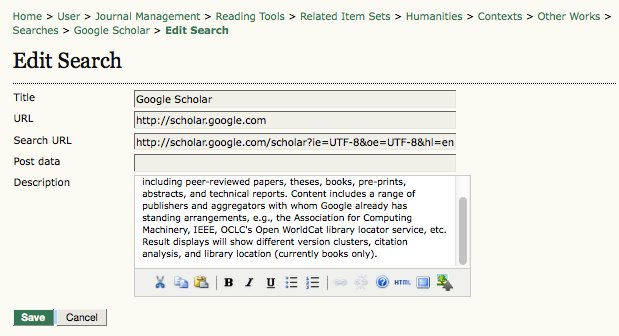
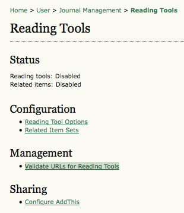
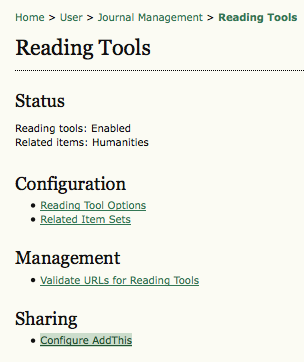

# Reading Tools

The Reading Tools are designed to assist experienced and novice readers by providing a rich context of related materials from a wide variety of largely open access sources. These optional tools use an author's keywords to automatically search a relevant open access database for related materials which are presented to the reader in another window. Readers have a choice of tools, and within each tool a choice of databases, along with access to information about the database. 

## Configuring the Reading Tools

By default, the Reading Tools are disabled. To activate and configure them:

* Go to Management Pages section and select Reading Tools.

  

* Choose Reading Tool Options.

Checking the "Enable Reading Tools ..." checkbox will activate them for your journal.

From the same page you can configure which tools will be available to your readers. You may wish to experiment with these yourself to see if some or all of them will be useful to your audience.

Under **Related Item Tools**, you will find a dropdown menu of subject areas. Select the subject that best matches your journal to provide an additional reading tool set specific to that discipline. For example, if you choose Humanities, you will not see search options for the Health Science index PubMed. Select the subject appropriate item set for your journal

To further customize the Reading Tools for your journal, Click **Related Items Sets** here, or return to the Reading Tools menu and choose Related Item Sets This will allow you to add or remove what resources are available to readers in the tool set.

From here, you will see a list of subject areas, and the configuration options for each of them.

For each subject, you will see a series of options: Validate, Metadata, Contexts, Export, and Delete. While scrolling down the page of subject items, you will also see the option to create your own set for a discipline not listed here.

**Validate** will check that all of the URLs for the resources associated with that subject are valid. Depending on the amount of associated resources, this may take a few minutes.

**Metadata** describes the subject item.

**Contexts** shows the various options that are available for that subject area.

**Export** creates an XML file of the items.

**Delete** removes the item.

Here are the options for each subject area found by selecting **Contexts** (example Humanities):

The Up and Down arrows allow you to reposition the contexts -- or you can click on the item in the Title or Abbrev column and drag the entry to a new position (this is easier than using the up and down arrows!). 

The **Metadata** link within Contexts allows you to rename tools and set options. 

    

The **Searches** link lets you view, edit, add, or delete the various resources associated with the context. This example shows the currently available search options under "Author's work".

Here you could revise the **Searches** options that will be available to readers under **Author's work** on their sidebar. You can use the Create Search link to add a new one, or use the Edit link to modify an existing one.

It's advisable to check the link on any url you make available.

You may need to contact the search service directly to find out the appropriate Search URL.

## Managing the Reading Tools

Returning to the Reading Tools menu, you can now choose **Validate URLs for Reading Tools** under the Management heading to test all of the Reading Tool URLs. This can take a few minutes, as all of the URLs are tested. Use the configuration options outlined previously to fix any broken URLs (and delete any non-function search services).

   

## Sharing the Reading Tools

This option will allow you to add social networking links (Facebook, Delicious) to your Reading Tools via the [AddThis](http://addthis.com) service. 

* First, under Sharing select Configure AddThis.

  
  
* Next, fill in the form with your AddThis information (you will need to visit their site and create an account first).
  

  

Once this is saved, the sharing image/link will appear in your sidebar.

## Displaying the Reading Tools

Reading Tools must be configured in [Journal Setup Step 5.6: The Look -- Journal Layout](https://pkp.gitbooks.io/learning-ojs-2/content/en//step_five_the_look.html) before they appear. Both the Reading Tools and Related Items are treated as blocks, and can be moved from the left sidebar to the right, and moved up and down in the block hierarchy.

