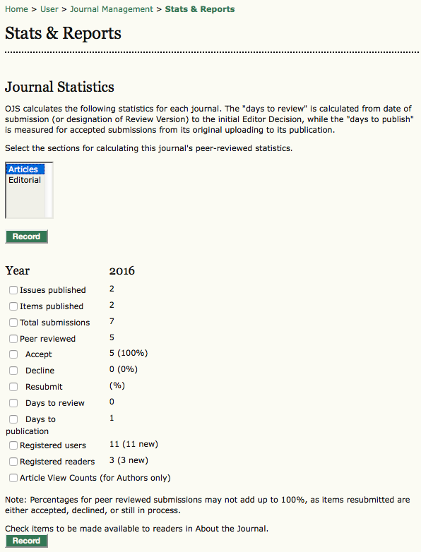
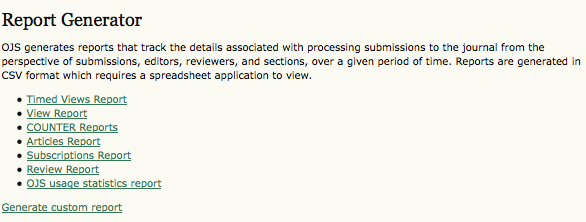
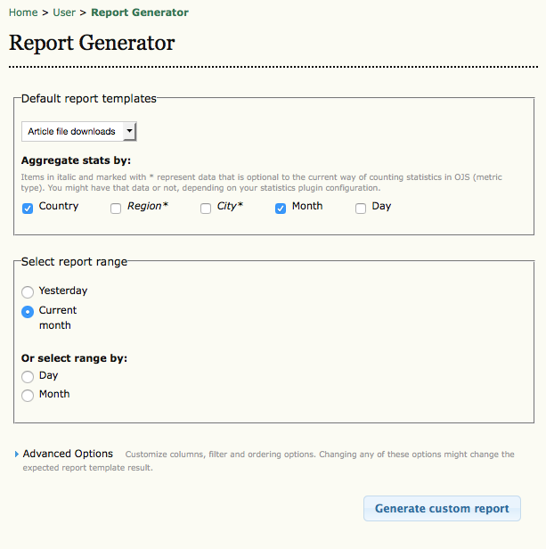

# Statistics and Reports

OJS provides a number of statistical and reporting features for your journal. To access them, go to the Journal Management Pages and select **Stats & Reports**.

### Statistics

The Statistics section provides a summary of your journal's usage. You can use the checkboxes to make these statistics available to readers in About the Journal. If your journal has been running for several years you would be able to click through by year and see totals for issues and items published, and other powerful statistics.

### Reports

The Reports section provides spreadsheets of data on all of the articles submitted to your journal, all of the reviews that have been done, and other aspects of your journal's activity.

The following reports are offered in CSV format:

* **View Report** summarizes abstract view counts, and total counts for galley views on a per-article basis for every published article. 
* **Articles Report** summarizes all of the articles in your journal with title, author and status data.
* **Subscriptions Report** summarizes membership information for individual and institutional subscriptions
* **Review Report **summarizes the review activities including article and reviewer names, and dates of assignments.
* **OJS Usage Statistics Report** Summarizes all published objects \(article, galleys, issue, issue galleys\) view or download counts, and also the journal index page view counts.

**Timed Views Report** allows you to select a date range for reporting. You can also choose to remove records from the logs in **Clear Logs**.

The COUNTER plugin is available for COUNTER-style journal reporting. Be sure to check the requirements on the [Project COUNTER ](http://www.projectcounter.org/)website.

The option to **Generate a Custom Report** is also available by selecting the link from the Stats & reports page.

Report templates are available, and you can make selections based on location and date range. Advanced options allow you to customize columns to build the report, choose filters to narrow results, and select the order in which results will display.

Click **Generate custom report** to create a CSV file with your results. A Report URL is also generated, which you can be use to generate the report at a later time with the current form settings.

For more detailed information, see [OJS Report Generator: Examples and Tips](https://dl.dropboxusercontent.com/u/9529729/OJSReportGeneratorExamplesandTips.pdf).

### **Display Statistics**

You can display statistics for your readers using plugins. See [System Plugins](https://pkp.gitbooks.io/learning-ojs-2/content/en/system_plugins.html) for more information.

