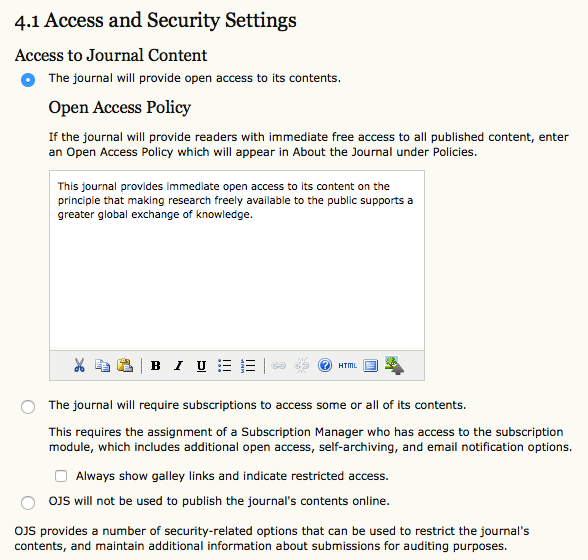
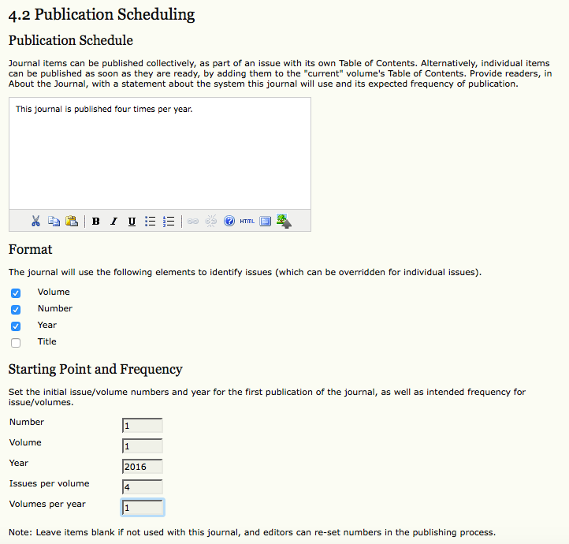
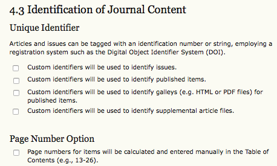
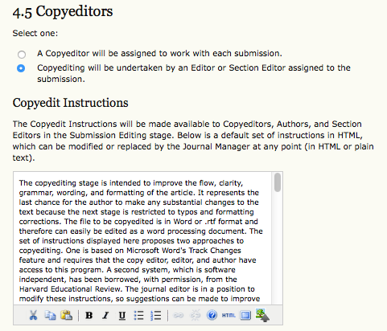
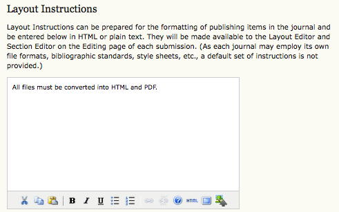
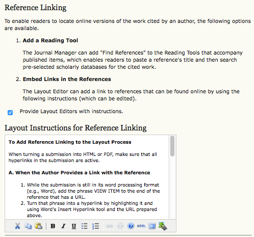
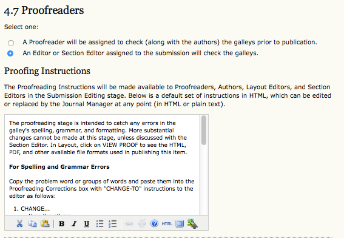

# Step Four: Managing the Journal

Here you can set the journal's Open Access policy, control how users register on the site and for what, and define copyedit and layout instructions.

### 4.1 Access and Security Settings

This section provides a number of options for access to your journal's content.

* **Access to Journal Content:** Here are you can decide between full open access or the use of subscriptions to control access to some or all content. If you enable subscription control, you can allow for delayed open access to content. You may also target individual articles as openly-available within a subscription issue. If subscription access is chose, the role of Subscription Manager will be created, allowing for the creation/management of subscriptions, subscription types, and subscription policies.

  
* **Additional Site and Article Access Restrictions:** You can further restrict site- and article-level access through the use of user registration, and decide how users are allowed to register themselves. The advantage of selecting these options is that anyone wanted to read your content will need to register, providing you with reliable readership statistics (especially in the absence of subscriptions). The disadvantage, however, is that some potential readers will simply click away from your site rather than creating yet another user account.  

   

* **User Registration:** Select these options to allow visitors to enroll themselves as Authors, Reviewers, or Readers.

  
    

### 4.2 Publication Scheduling

OJS allows you to set the publication schedule that is best for your journal.    

  
  

### 4.3 Identification of Journal Content

Digital Object Identifiers are becoming increasingly common for online journals, and OJS supports them. You can visit [The DOI System](http://doi.org/) to learn more about registering for a Digital Object Identifier for your journal. A page number option is also available for journals. This is often useful for print journals that are going online.  

### 4.4 Announcements

This allows you to create an Announcements page for your journal web site, and post messages to your readers. Once this is activated, an Announcements link will automatically appear in the navigation bar of the journal, and an Announcement section will be added to the Journal Manager's Management Pages menu.

### 4.5 Copyeditors

The Copyeditor edits submissions to improve grammar and clarity, works with authors to ensure everything is in place, ensures strict adherence to the journal's bibliographic and textual style, and produces a clean, edited copy for the Layout Editor to turn into the galleys that will be in the published format of the journal. If you have individuals to act as copyeditors, select the first option. If your editors will be acting as copyeditors, select the second option. The instructions will be made available to copyeditors, authors, and section editors in the Submission Editing stage.

  
### 4.6 Layout Editors

The Layout Editor transforms the copyedited versions of the submission into galleys in HTML, PDF, PS, etc., files which the journal has elected to use for electronic publication. If you have individuals to act as layout editors, select the first option. If your editors will be acting as layout editors, select the second option.

**Further options in this section include:**

 * **Layout Instructions:** The instructions will be made available to layout editors and section editors on the Editing page of each submission.  

 * **Layout Templates:** These templates can be created in any file format (e.g., Microsoft Word) and be used by the Layout Editor to ensure a consistent design.  

  

 * **Reference Linking:** This option allows you to provide instructions to your Layout Editors to add reference links to articles. This is not a requirement, but is a very useful feature to make available to your readers.

  

### 4.7 Proofreaders  

  

The Proofreader carefully reads over the galleys in the various formats in which the journal publishes (as does the author). The Proofreader (and the Author) records any typographic and formatting errors for the Layout Editor to fix. If you have individuals to act as proofreaders, select the first option. If your editors will be acting as proofreaders, select the second option. The instructions will be made available to proofreaders, authors, layout editors, and section editors in the Submission Editing stage.