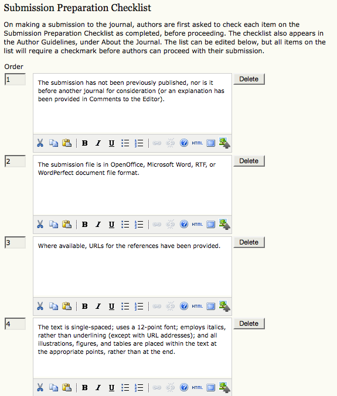
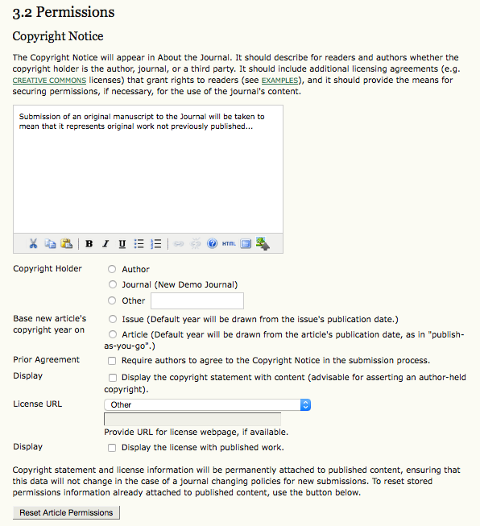
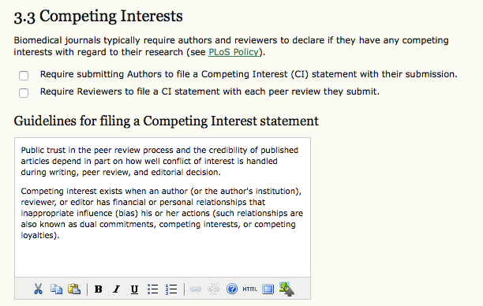
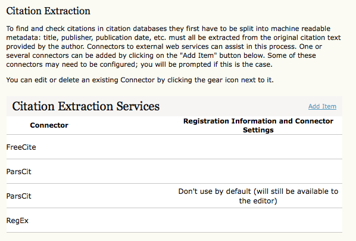
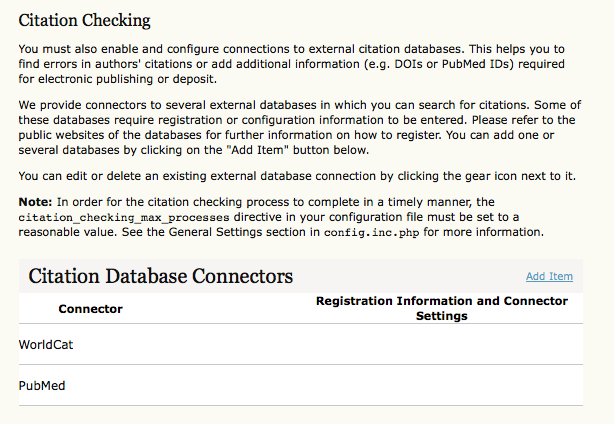

# Step Three: Guiding Submissions

### 3.1 Author Guidelines

These guidelines will appear on the About the Journal page and be available for potential authors to consult before submitting.

   

  
  You can also configure the Submission Preparation Checklist in this section. When submitting an article to your journal, authors will be asked to ensure certain conditions are met using this submission preparation checklist. Authors will not be able to proceed past the first submission step until they agree to all checklist conditions. Default items are provided, but you may add new ones or delete any that do not apply to your journal by using the Add Checklist Item or Delete buttons.

### 3.2 Copyright Notice

The copyright notice you write here will appear on the About the Journal page. You also have the option to require that authors agree to your copyright notice before completing their submission, and to add a Creative Commons license to the journal web site.

### 3.3 Competing Interests

This allows for the option of requiring authors and/or reviewers to file a Competing Interests statement.

### 3.4 For Authors to Index Their Work

Carefully selecting the most appropriate disciplines, classification system, and keywords will enhance the ability of others to find your articles. In OJS, Authors index their own submissions, but this information can be checked over and changed by Editors at any time. This form allows you to select from a number of indexing formats, add relevant examples to guide the authors, and provide them with a link to a subject classification system (such as the Library of Congress).

###3.5 Register Journal for Indexing

You can register the contents of your journal with the Public Knowledge Project Metadata Harvester or other OAI-compliant services (e.g., OAIster), which will allow for comprehensive searching among sites that adhere to the OAI Protocol for metadata harvesting.  

  

### 3.6 Notification of Author Submission

You can request a notification email be sent to the journal's primary contact, or another address, whenever an author has completed the submission process.  

### 3.7 Citation Markup Assistant

You can configure a Citation Markup Assistant for your Editors, Section Editors and Copyeditors to use during the manuscript editing process. This Assistant will allow Editors to check the Author's list of references against external databases, and will convert approved citations into NLM XML or any of a variety of citation styles for inclusion into the final galley files. If you enable this feature, Authors will be asked to submit their list of references in a separate field during Step 3 of the submission process.

Configuration of the Citation Markup Assistant consists of four general steps:  

* **Enabling the Citation Markup Assistant**. Unless this step is done, Editors will not have access to the Assistant.

* **Configuring the Citation Extraction Services**. These services allow the system to extract and parse citation information from the list of references the Author provides.

  
* **Configuring the Citation Database Connectors**. These connectors will allow Editors to check the extracted citations against external databases for added accuracy.

  
  
* **Configuring the Citation Output**. This allows you to configure which kind of citation style Editors will use to compare extracted citations against. 

Once these steps have been completed, Authors will be able to submit references separately, Editors will be able to use the Citation Markup Assistant to extract and check them, and the citations will be subsequently available in a variety of export formats including NLM XML and citation-style-specific formatted text. 

