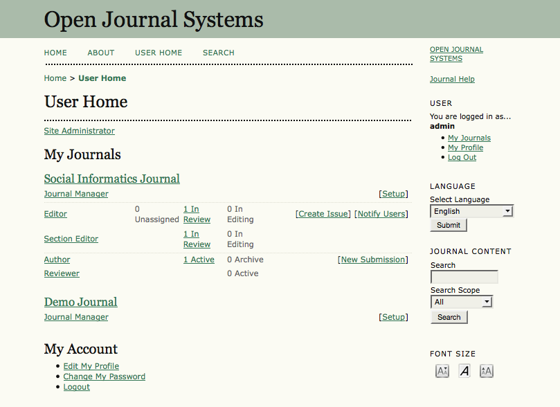

# Chapter 3: User Roles

# About User Roles

OJS uses a comprehensive roles system to divide work between users, assign workflows, and limit access to different parts of the system. Since one installation of OJS can host multiple journals, users can be enrolled in different roles for more than one journal.

When a user logs into the system, they will be taken to their User Home page. From here, they will see a list of the roles they belong to for each journal in the system (along with user-specific links to edit their profile, change their password, etc.). In the example below, the user has been enrolled as a Site Administrator; as a Journal Manager, Editor, Section Editor, Author and Reviewer for the Social Informatics Journal; and as a Journal Manager for Demo Journal. A user might be an Editor in one journal (with all of the accompanying permissions), but only an Author on another (and limited to only performing Author tasks for that journal).

**User Home**  

Users can subsequently return to this listing by clicking either the **My Journals** link in the User block in the sidebar, or the **User Home** link in the topmost navbar; either link will return them to their site-wide User Home.

Journals can be configured to allow users to self-enroll as Readers, Authors, and/or Reviewers, or self-registration can be disabled completely. Access to journal content, or even to the journal itself, can be limited to registered users, and subscription support can also be enabled.