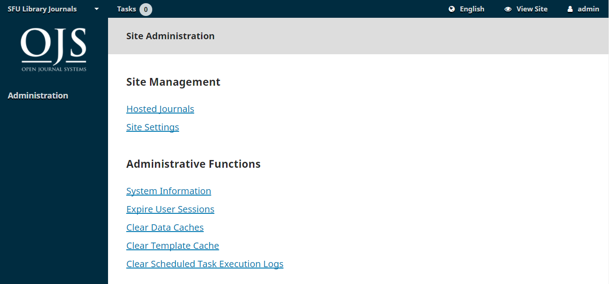
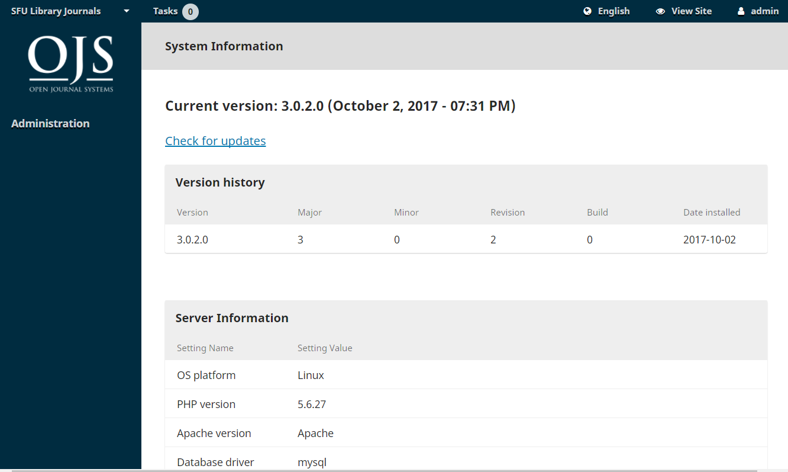

# Administrative Functions

This section provides detailed information about the server on which your OJS installation is running.

## System Information

Use this section to find out details about the server running your installation.

OJS Version information shows which version is currently installed, and your version history including any upgrades. You can click the Check for updates link to see if you are using the most recent version of OJS.

The Server Information provides details about the server environment hosting your OJS installation.

The OJS Configuration section displays all of the configuration options and their values as they are in _config.inc.php_.

You can find more information about _config.inc.php_ configuration parameters in the file itself.

The final section on this page displays additional server information: your operating system, PHP version, server and database information. You can also view extended PHP information by clicking the Extended PHP information link (this displays the output of ``phpinfo()``)

All of this information can be useful when trying to troubleshoot a problem.

## Expire User Sessions

Clicking _Expire User Sessions_ immediately clears all active user sessions in the system, requiring any user that is currently logged in to sign in to the system again. This can be useful before an upgrade, to ensure all users are logged out.

## Clear Data Caches

Clicking _Clear Data Caches_ clears all cached data, including locale information, help cache, and search cache. This function may be useful to force data to be reloaded after customizations have been made.

## Clear Template Cache

Clicking _Clear Template Cache_ clears all cached versions of HTML templates. This function may be useful to force templates to be reloaded after customizations have been made.

## Clear Scheduled Task Execution Logs

If scheduled tasks have been enabled for your journal, clicking _Clear Scheduled Task Execution Logs_ will delete the task execution log files from your server. The execution log files include dates that correspond to previously completed scheduled tasks \(e.g. sending automatic email review reminders\).
