# Chapter 14: Editorial Workflow

In this chapter, you will follow as submission throughout the workflow, from first submission to final publication.

The workflow is divided into 4 stages:

**Submission**: This is where new submissions land while being assigned to Section Editors and considered for moving into the Review stage.

Some submissions are clearly inappropriate and never make it beyond this stage.

**Review**: This is where the peer review happens, as well as any revisions required by the author.

Some submission will not pass review and end here. Those that are accepted move to the next stage.

**Copyediting**: Accepted articles move to this stage, where they are improved by the work of a copyeditor. Authors can be given the opportunity to review the copyedits.

**Production**: Once the copyedits are completed and approved, the submission moves to this stage. In Production, the copyedited files are converted to galleys -- HTML, XML, PDF, etc. Again the author has the opportunity to proofread the galleys. Once everyone is satisfied, the submission is scheduled for publication in a future issue.

## Tasks

Your Tasks are available from the top left menu of your Dashboard. Note the number "1" in the image below. This indicates that there is currently 1 task in your list.

Tasks provide a quick look at items that need your attention. Bold entries are unread, and unbold entries have been read.

Use the checkbox to mark tasks for deletion \(the delete link is available at the bottom of the list\).

## Submission Notifications

When an author makes a new submission to your journal, the editor is automatically emailed a notification and the author will receive an email acknowledging their submission. You can also configure OJS so that a copy of the notification email is sent to the journal’s primary contact set in Journal Settings, or to another address.

To enable copies of submission acknowledgment email to be sent to the primary contact or another address:
1. In the Journal Manager’s dashboard, go to Settings > Workflow > Submissions
2. Scroll down to Notification of Author Submissions
3. Check off the box next to “Send a copy to the primary contact, identified in the Journal Settings.” if you wish for a copy to be sent to the primary contact email, and/or
4. Enter the email you would like to have a copy sent to in the text field.

If you want to disable submission acknowledgement emails entirely, you can do so by disabling the *Submission Ack* email template from the list of prepared email templates. To learn more about disabling and enabling email templates, refer to *Disable email templates* in the [Workflow Settings chapter](https://docs.pkp.sfu.ca/learning-ojs/en/journal-setup#workflow-settings).

Users can also change their individual notification settings from their own profile under View Profile > Notifications.

## Submission Dashboard

When you log into your Dashboard, you can find active submissions either from your Tasks, or from one of the queues \(My Queue, Unassigned, All Active, and Archives\).

### My Queue

**My Assigned**: This panel includes submissions added to sections where you are a section editor or to your own submissions if you are also an author with this journal.

The **Search** tool for each queue can sometimes be helpful in tracking down submissions.

The **Filter** tool allows you to limit your browsing to specific status \(e.g., incomplete, overdue\) stages \(submission, review, copyediting, production\), or sections \(e.g., articles, reviews\) for faster searching.

Note that you can use the blue arrows to the right of each submission to reveal more details, including how many reviews are outstanding, new discussions, and more. It also reveals buttons to take you to the submission record, view the activity log and notes, and to delete the submission.

### Unassigned

This panel includes submissions added to sections without section editors.

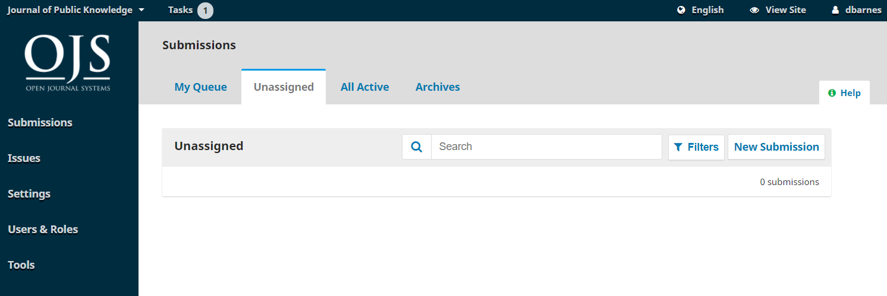

In the above example, there are no unassigned submissions, so the panel is empty.

### All Active

This section includes a list of all submissions, without being organized into queues.

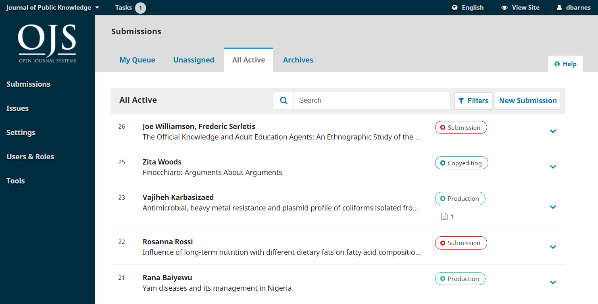

### Archived

This section includes a list of all submissions either rejected or already published by the journal.

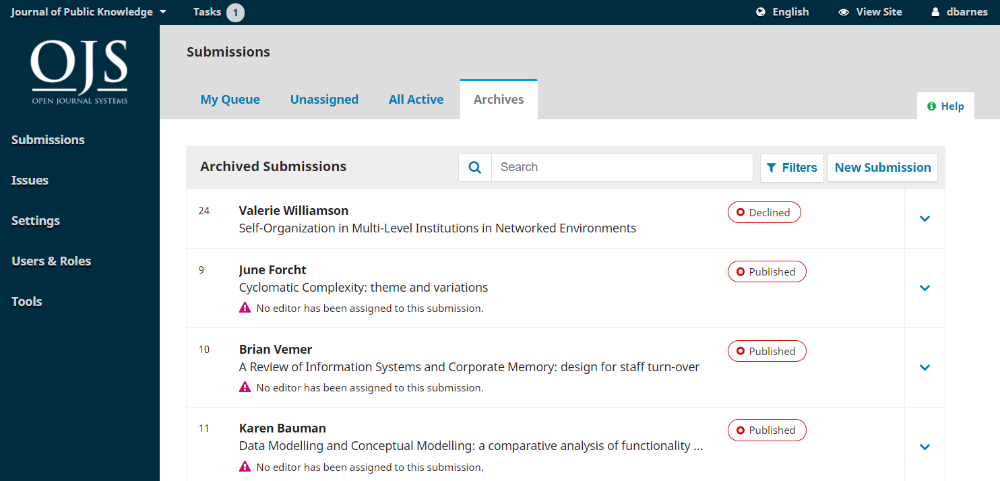

### Demonstration Submission

For this demonstration, we are looking for the Williamson and Serletis submission, entitled _The Official Knowledge and Adult Education Agents_. It can be found at the top of the **My Assigned** queue, as well as in the **All Active** queue.

Once you find the submission, you can use the blue arrow to reveal options to see if there are any open discussion \(there are none\), as well as to view the submission, view the activity logs and note, or to delete the submission.

**Delete** will move the submission to the Archives and **Activity Log & Notes** will bring up the submission's history.

### Submission Record

To view the submission in more detail, select **View Submission** button. This will take you to the submission record.

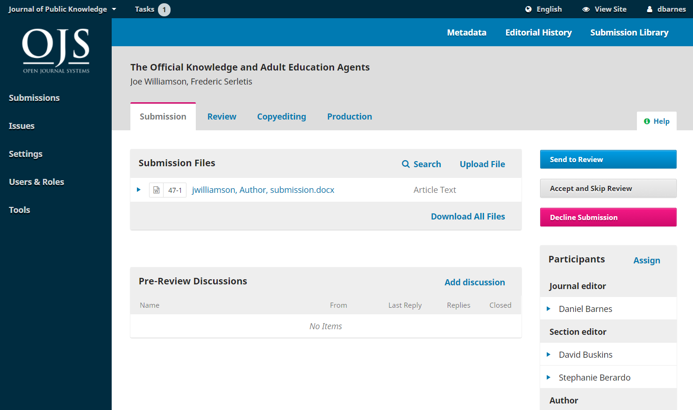

From here, you can see:

**Submission Files**: This panel lists the files that have been submitted. In this view, there is just one file, but multiple files could have been submitted.

**Pre-Review Discussions**: This panel allows the editor to communicate with the author, or with others on the editorial team. For example, to ask the author for some additional information, or to ask a section editor to take responsibility for this submission.

**Action Buttons**: These include Send to Review, Accept and Skip Review, and Decline Submission.

> Note: If you don't see these buttons, you likely have not yet assigned the submission to an editor.

**Participants**: This panel is where you will see the list of participants involved in the submission, including the editor, section editors, and author. Other names \(copyeditors, layout editors, etc.\) will appear here as they are added in subsequent steps.

In addition, in the blue bar along the top, you can see:

**Metadata**: Where you can view and revise the submission metadata.

Use the Identifiers tab to also view or add a unique identifier.

**Editorial History**: Where you can view the history and any notes about the submission.

Use the Notes tab to also view or add any editorial notes.

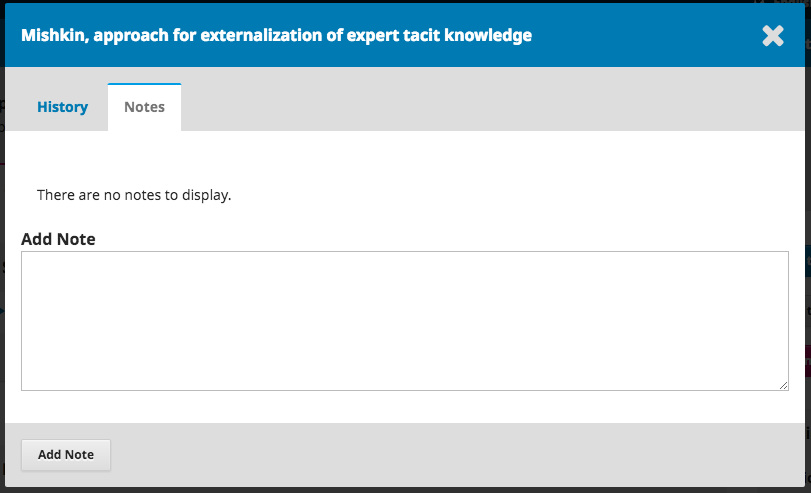

**Submission Library**: Where you can add any relevant documents to the submission's library.

### Assigning the Submission

Depending on how you have your sections configured, some new submissions may come in unassigned. If this is the case, the next step is to assign an editor or section editor. To do so, select the _Assign_ link in the **Participants** panel.

You will have the option to locate a user by role, choose an individual, and send them a message requesting their assistance.

> Note: If you aren't sure of the names of the section editors, simply choose that role from the dropdown menu and then hit the Search button. All Section Editors will be displayed and available for selection.

Hit the **OK** button to make the assignment and send the message.

> Note the new Pre-Review Discussion that was automatically created as part of the assignment.

You can now see that the Section Editor is listed under Participants, and the Action buttons are available:

**Send to Review**: Moves the submission on to the next stage.

**Accept and Skip Review**: Skips the Review Stage and moves the submission directly into Copyediting.

**Decline Submission**: Rejects the submission before going through the review process. The submission would then be archived.

Although in this example, the editor assigned a section editor, it would also be possible for the editor to assign themselves to the submission.

### Section Editor

Now that the Section Editor has been assigned, they can login and view their dashboard. The submission can be found at the top of the My Assigned queue.

Clicking on the article title opens the full submission record.

#### Accepting the Assignment

It is not required, but the Section Editor could reply to the Pre-Review Discussion to inform the editor that they will be proceeding with the assignment.

#### Communicating with the Author

If the Section Editor has any questions for the author, they can use the Pre-Review Discussions.

#### Sending to Review

Once the Section Editor is satisfied that the submission is appropriate for the journal, they can select the **Send to Review** button to move the submission to the next stage.

Keep the files that are to be reviewed checked off.

## Review

When the submission enters the Review Stage, a notification indicates that Reviewers need to be assigned.

> Note: In the screenshot above, we see the Section Editor's view. Notice the limited Action buttons \(only Make Recommendation is available\). If we were logged in as an Editor, we would see more Action buttons \(Request Revisions, Resubmit for Review, Send to Copyediting, Decline Submission\).

From the Reviewers panel, you can select Add Reviewer to assign a new Reviewer.

This opens a new window, where Reviewers are listed and can be selected one at a time.

Clicking on the blue arrow reveals more information about their review history, including how many active reviews they are currently assigned, how many reviews they have completed or declined, etc. If the user has added a Biography or Reviewing Interests, this information will be displayed here.

Additionally, a Journal Editor can add an Editorial Note about the reviewer in their profile under Users & Roles > Users. This note will appear in the reviewer details on the Add Reviewer screen, but will not be visible to the reviewer or to the public.

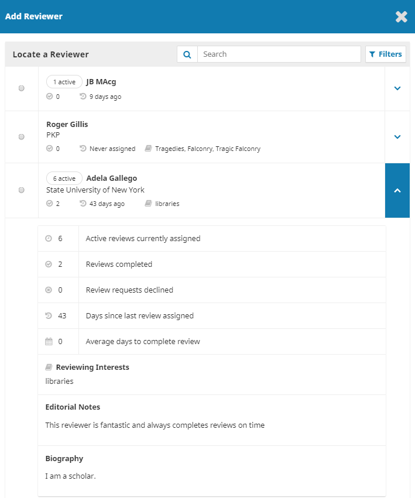

In OJS releases 3.0 to 3.1.0, you cannot assign a user to review a submission if they are also an editor of the submission.  If you do, the editor will no longer be able to access the submission after they submit their review, in order to maintain the principles of blind peer review. However, starting with OJS 3.1.1, you can assign a user to review a submission if they are also an editor of the submission.

At the bottom of this form, you will see options to:

**Select Reviewer**: Use this to confirm your selection once you have picked a Reviewer from the list.

**Create New Reviewer**: If none of the Reviewers are suitable, you can use this button to create a new Reviewer. This is a new account in the system.

**Enroll Existing User**: If none of the Reviewers are suitable, you can enroll an existing user as a Reviewer.

For this demonstration, we will pick Adela as our Reviewer and hit the **Select Reviewer** button.

This initiates a new window with a message for the Reviewer.

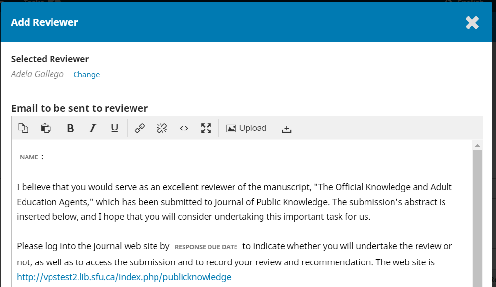

You can revise any of the prepared text.

If you are using a Blind Review method, ensure that the files you send to the Reviewer are stripped of any identifying information about the Author. Additional instruction for this is provided in the [Understanding Blind Review](#understanding-blind-review) and [Removing Identifying Information](#removing-identifying-information) sections.

Further down the form, you will see the additional details that are sent to the Reviewer including title, abstract, important dates, and a link to the files to be reviewed.

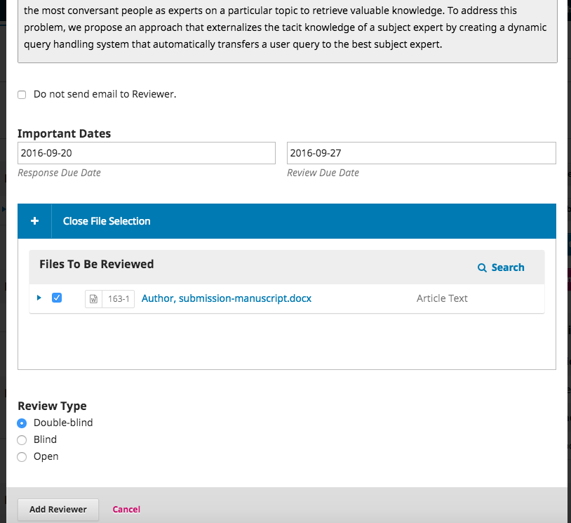

By default, Reviewers will be provided with an extended text box to type in their comments. However, the Journal Manager can create Review Forms in [**Workflow Settings &gt; Review**](https://docs.pkp.sfu.ca/learning-ojs/en/journal-setup#workflow-settings) to ask more focused questions. If you would like the Reviewer to fill out a review form, select it under **Review Form**.

Hit the **Add Reviewer** button to send the message and assign the Reviewer.

Back on the Review Stage, we can see the Reviewer is now listed.

You can make additional changes using the blue arrow toggle next to the Reviewer's name.

**Review Details**: Provides details on the review.

**Email Reviewer**: Allows you to send a message to the Reviewer.

**Edit Review**: Allows you to change the review dates and files.

**Unassign Reviewer**: Allows you to unassign the Reviewer.

**History**: Provides a brief history of the review.

At this point, we could add additional Reviewers, and then wait for their recommendations to come in.

### Understanding Blind Review

OJS is designed to accommodate different types of reviews and has built-in steps to ensure anonymity.

All information will be visible to the journal managers and editors regardless of the type of review selected.
The review type will be automatically selected based on what has been configured under _Settings_ > _Workflow_ > _Review_. The editors can change the review type when sending the review request. Editors/Section Editors must select the review type when sending the review request from the following options:

* Double-Blind
* Blind
* Open

**Double-Blind Review**: The identity of both the author and the reviewer is kept hidden.

The author or editor must ensure that metadata from the manuscript file is removed in a Double-Blind review. See [Removing Identifying Information](#removing-identifying-information) for more information.

*Reviewer*: The reviewer will not be able to see the author(s) in their reviewer’s queue if the editor has selected a double-blind review. All identifying information in the metadata of the submission details is automatically removed by the system.

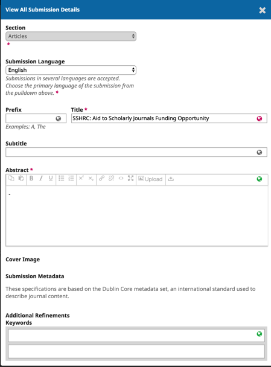

At the end of a review, if a reviewer chooses to upload a review file they should remove all identifying information before uploading it to the system. See [Removing Identifying Information](#removing-identifying-information) for more information.

*Author*: No identifying information regarding the reviewer will be visible to the author within their manuscript view.

*Editors Decision*: The decision email sent to the author(s) at the end of a review will have generic titles of the reviewers.

**Blind Review**: Reviewer identity is kept anonymous from the author(s). The reviewers can see the author details.

*Reviewer*: The reviewer is able will see full the metadata entered by the author by clicking _View All Submission Details_ in the request tab of the manuscript. The authors’ name will also appear in the reviewer's queue.

*Author*: No identifying information regarding the reviewer will be available within their manuscript view.

*Editors Decision*: The decision email sent to the author(s) at the end of a review will have generic titles of the reviewers.

### Removing Identifying Information

While OJS has a number of built-in functions for blind reviews, additional steps may need to be taken outside of the platform to ensure a Double-Blind Review. A submission file may have information that could identify the authors' identity within the document properties.

Authors may also include their name within the article, footnotes, or references, in which case the editor will have to remove it prior to sending for review. Alternatively, authors can be asked to redact their names from the submission file, with "Author" and year used in the references and footnotes instead of the authors' name, article title, etc., prior to submission.

#### Microsoft Word for Windows

1. Go to _File_
2. Select _Info_
3. Click on _Check for Issues_
4. Click on _Inspect Document_
5. In the _Document Inspector_ dialog box, select the check boxes to choose the types of hidden content that you want to be inspected
6. Click _Remove All_
7. Click _Close_
8. Save the document

#### Microsoft Word for MacOS

1. Go to _Tools_
2. Click _Protect Document_
3. Select _Remove personal information from this file on save_
4. Click _OK_ and save the file

### Re-uploading the Document

The Journal Managers and Editors are able to re-upload the anonymized document in the Review files by clicking **Upload/Select Files** in the _Review Files_ box.

Click **Upload Review File**.

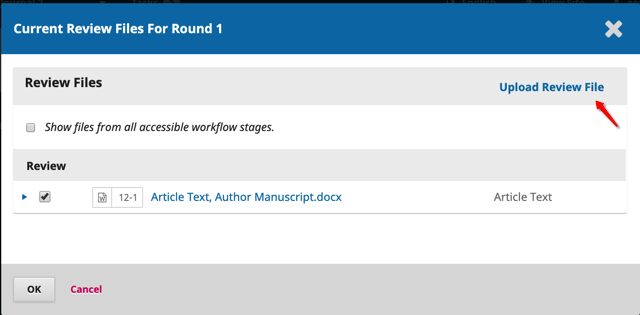

Identify the article component and upload the file.

Review Details. It may be helpful to rename the file to the time of re-upload. The file can also be renamed by clicking the arrow on the left side of the file name.

Click Complete and select the file you would like to use for the review.

The file(s) will appear under the initial upload.
When sending out the review request, ensure that the original manuscript is unselected from the ‘Files To Be Reviewed’.

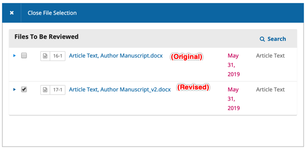

Select the Review File(s) and click **OK**.

### Responding to Reviews

Once the Reviewers have completed their work, the Section Editor can see the results in their dashboard. Here they will see notifications that new reviews have been submitted and whether all reviews are in.

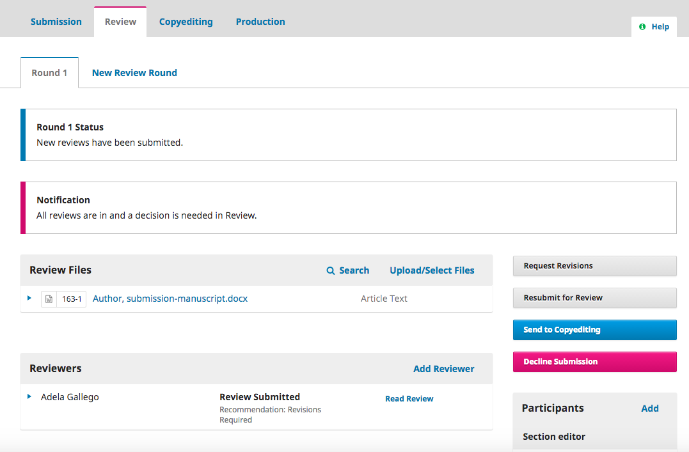

Use the _Read Review_ link in the Reviewers panel to read the comments from the Reviewers, including those for both the Author and Editor as well as for the Editor only.

Select the _Confirm_ link at the bottom of the screen.

In the Reviewers panel, you can now see a _Thank Reviewer_ link. Choose that to thank the Reviewer.

Hit the **Thank Reviewer** button to send the message.

### Making the Decision

Based on the Reviewer recommendations, you can use the action buttons to make a decision.

Options include:

**Request Revisions**: This will require the Author to make minor changes, but no further peer review is required.

**Resubmit for Review**: This will require the Author to make major changes and another round of review will need to take place.

**Send to Copyediting**: This means the submission is accepted without revisions and can proceed to the Copyediting stage.

**Decline Submission**: This means that the submission has not passed peer review and is unsuitable for further consideration. The submission would then move to the Archives.

### Request Revisions

In this demonstration, we are going to request that the Author make some minor revisions before acceptance.

To do so, select the **Request Revisions** button. This results in a new message window.

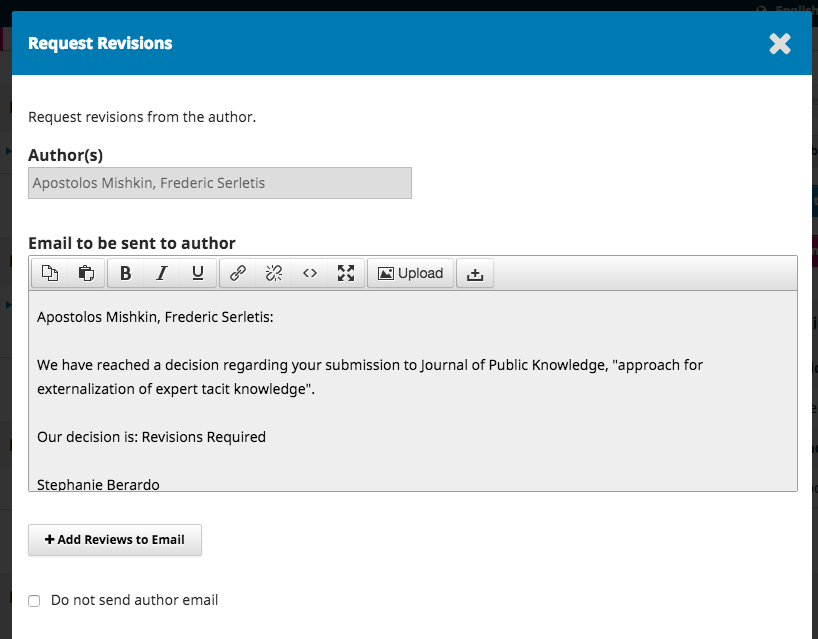

You can modify any of the text before sending the message.

Use the **Add Reviews** button to import the Reviewer's comments from the Editor and Author field. Comments in the Editor only field will not be displayed.

If there are any attachments, such as a marked up file created by a Reviewer, you can attach it here \(as long as it has been anonymized\).
In OJS 3.1.2 and later, you can also upload a new file and add it as an attachment.

Hit the **Record Editorial Decision** button to send the message.

You must now wait for the Author to respond with their revisions.

### Author Responds

Once the Author has made the revisions, you should receive a message \(via email and the Review Discussions panel\).

You will also see the revised file in the Revisions panel.

At this point, you can download the revised file, check to make sure it is ready, and communicate with the Author using the Review Discussions panel.

In this case, we're going to inform the Author that we are accepting the revisions. To do so, click on the linked title of the discussion. This will open the discussion box.

Use the **Add Message** button to reply.

Another option would be to ask for further revisions, but at this point, we're ready to move on.

### Moving to Copyediting

The submission is now ready to be moved to copyediting. To do so, use the blue **Send to Copyediting** button.

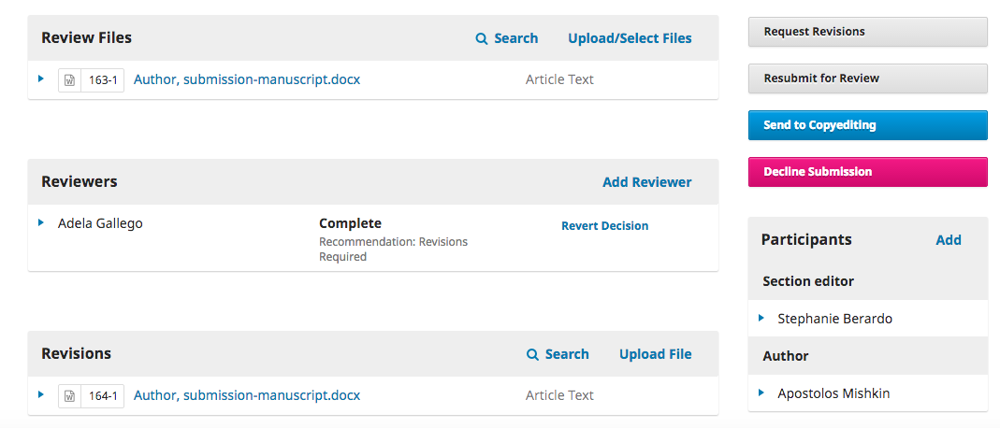

This will open a new window.

Hit the **Record Editorial Decision** button at the bottom of the window.

The submission is automatically moved to the Copyediting stage.

## Copyediting

When a submission is approved in the Review Stage, it will automatically move to the Copyediting stage.

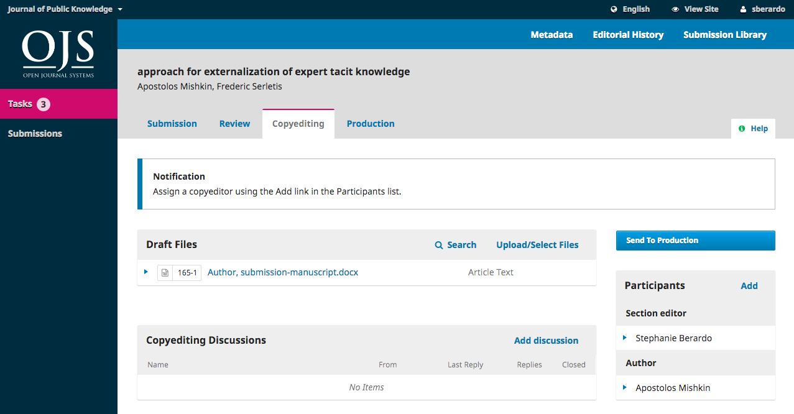

### Adding a Copyeditor

When the submission enters the Copyediting Stage, a notification indicates that a Copyeditor needs to be assigned. Copyeditors can be assigned using the *Add* link on the Participants panel.

This will open a new window.

You can use the role dropdown to choose Copyeditor and hit the **Search** button. This will bring up all Copyeditors.

Select one of the Copyeditors for this submission.

Choose a prepared message.

Make any changes needed to the message.

Hit **Send**.

You can now see the new notification that the submission is awaiting copyedits, the Copyeditor is now included in the Participants list, and the request is visible in the Copyediting Discussions.

You can now wait for the Copyeditor to do their work.

### Copyeditor

The Copyeditor will receive an email message from the Section Editor requesting them to take on the submission.

To get started, they must login and find the submission from their dashboard.

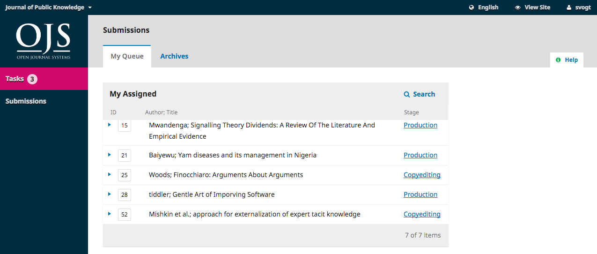

Then, they can click the Copyediting link next to the submission name. This will take them directly to the Copyediting stage for this submission.

From here, they can see the Draft Files. These are the files that require copyediting. Clicking on the linked title will download the file to their desktop.

Outside of OJS, they will do the copyediting work.

To check the submission metadata, use the Metadata link in the blue bar at the top.

This would include checking the article title, abstract, author names, keywords, etc.

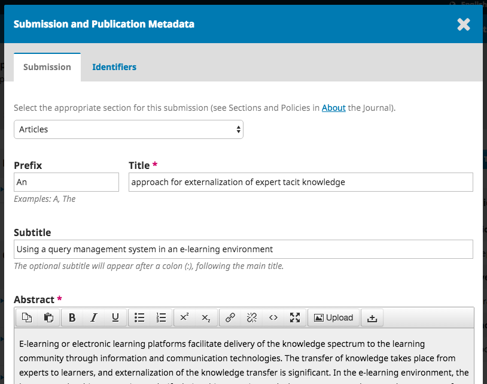

If any changes are made, hit the **Save** button before exiting this window.

#### Consult with the Author

Once they have finished copyediting, they will run the changes past the Author by adding a new discussion, using the Copyediting Discussions panel's *Add discussion* link.

From the Add Discussion window, they must choose the Author and add a subject line and message.

Further down that same window, they must upload a copy of the copyedited file.

To do so, use the *Upload File* link. This will open a new window where you must choose the *Article Component* (e.g., article text) and upload the file.

Hit **Continue** to proceed.

This will open the next step, where you can edit the filename if needed.

Next, you can upload more files if necessary, or hit **Complete**.

Back on the Add window, you can now see the attached file.

Hit **OK** to send the message to the author.

It is now visible in the Copyediting Discussions.

You can now wait for the author's response.

### Author Responds

Once you hear back from the author, you can review their feedback by checking the discussion reply.

From here, you can see no further changes are required.

### The Final Copyedited File

Now you can go ahead and upload the final copyedited version to the Copyedited panel, near the bottom of the screen.

Use the Upload/Select Files link to upload the final copyedited version.

It is important to note here that you have a few choices.

1. You can use the Upload File link to upload a new file (e.g., a file with some recent changes since you showed it to the author).
2. You can select the Author's original version (unlikely).
3. You can select the Copyeditor version, which is the version you sent to the author (if you made no further changes, choose this one).

For this demonstration, we will select the Copyeditor version **by checking the box** to the left of that file.

Hit **OK**.

The file is now visible in the *Copyedited* panel (near the bottom of the screen), indicating to the editor that this is the final version, which is ready for the Production stage.

### Inform the Section Editor

The final step is for you to inform the Section Editor that the copyediting is complete.

To do so, start a new Copyediting Discussion by using the *Add Discussion* link.

In the discussion window, add the Section Editor, a subject line, and a message.

Hit **OK** to send the message.

Returning to the Copyediting stage, you can see the message is posted.

Your work as the Copyeditor is now complete!

### Moving to Production

The Section Editor will receive an email that the copyediting is complete, and see a notification in the discussions.

You can download and review the final copyedited version from the Copyedited panel.

At this point you could communicate further with the Copyeditor, or, if you are satisfied, move the submission to the Production stage.

To do so, select the blue **Send to Production** button.

This will generate an official notice to the Authors that the submission is moving to the next stage.

Notice that the appropriate file, from the Copyedited panel, is included and will be automatically transferred to Production.

Hit **Record Editorial Decision** to proceed.

The Copyediting stage is now complete.

## Production

With the completion of the Copyediting stage, the submission now moves to Production. From here, the copyedit files \(often Microsoft Word files\) will be converted to publishable formats in the form of galley files \(e.g., PDF, HTML\) and proofread before publishing.

To start working in Production, the Section Editor must login to the system and choose the submission from their dashboard.

Choosing the Production link will open the submission record.

You will see the copyedited files are now available in the _Production Ready Files_ panel.

A notification banner also indicates that you must assign someone to create the galley files \(e.g., the PDFs, HTML, etc.\) from those production ready files.

This can vary from journal to journal -- you may have layout editors or production assistants to do this work.

To make the assignment, use the _Add_ link in the Participants list. This will open a new window.

Use the role selector and search button to find appropriate users, select one, choose a predefined message, and hit **OK** to send.

The user has now been notified via email and in the dashboard.

Notice that the notification now indicates the submission is "Awaiting Galleys". You can see the layout editor in the Participants list, and you can see the request notice in the Production Discussions panel.

You can now wait for the Layout Editor to complete their tasks.

### Layout Editing

As a Layout Editor, you will have received a message inviting you to create the galleys for the submission.

To get started, login to the system and go to your dashboard.

From here, find the submission and select the Production link.

This will take you to the submission record.

From the Production Ready Files panel, download the files to your desktop and work outside of OJS to convert them to the formats appropriate for your journal \(e.g., HTML, PDF, etc.\).

> Note: PKP is currently working on a project to automate the conversion of Microsoft Word documents into other formats, including XML, HTML, PDF, EPUB, etc. Keep an eye on our blog for updates.

### Deciding on Article File Formats

Online journals today publish their articles in a variety of file types. Most common are the PDF and HTML, but increasingly additional formats are being used, such as ePub, MP3, and XML.

The majority of author submissions come in as Microsoft Word documents \(.doc or .docx\), and typically move through the OJS workflow \(review, revision, copyediting\) in that format. Other formats sometimes include text \(.txt\), rich text format \(.rtf\), or Open Office \(.odt\). These aren't suitable for final publication, so will need to eventually be converted into a more reader-friendly format.

#### Working from Templates

Requiring all submissions to use a template that is pre-formatted with your journal's publication styles \(e.g., the font face, font size, boldness, placement, etc. of the header, body, footers, etc.\) will make your document conversion much easier.

Microsoft provides a brief overview for creating templates [here](https://www.gitbook.com/book/pkp/ojs3/edit#).

Once you've created a template that matches your journal style, you should link it from your Author Guidelines, along with a brief explanation of the need to use the template. This means that all of your submissions will come in already formatted, saving your layout editor a significant amount of work.

Here's an example of an OJS journal that requires authors to download and use a template file: [Paideusis](https://journals.sfu.ca/pie/index.php/pie#authorGuidelines).

Ideally, your template should be created using styles rather than direct formatting. This not only ensures consistency throughout your documents, but will also aid in any conversions to other formats \(e.g., HTML\). Here's an [explanation of the difference between styles and direct formatting in Word](https://support.office.com/en-us/article/Style-basics-in-Word-d382f84d-5c38-4444-98a5-9cbb6ede1ba4?CorrelationId=1b00844c-a9dc-4d62-98df-a966f30d4b20&ui=en-US&rs=en-US&ad=US&ocmsassetID=HA010230882).

#### Creating PDF files

A PDF is the easiest type of file to create from a Word document. Current versions of Microsoft Word \(and other word processors\) let you simply "Save As" a PDF. The majority of OJS journals publish their articles as PDFs.

PDFs are also popular with many readers, as they most closely recreate the printed page. However, PDFs are often less flexible on mobile devices and do not always handle links or embedded media \(such as sound or video files\) particularly well. With the growing importance of mobile computing, ensuring your audience can easily read your articles on their phones or tablets is increasingly important.

Example \(see PDF link at bottom of page\): [Irish Journal of Technology Enhanced Learning](http://www.journal.ilta.ie/index.php/telji/article/view/22/51)

#### Creating HTML Files

HTML files have the advantage of flexibility. They handle linking and multimedia very well, and can fit on just about any screen - including phones and tablets. They do, however, look different than a printed page, so some readers continue to prefer a PDF. The ideal situation is to provide both PDF and HTML files to best meet the needs of your different users.

We saw in the previous section that creating a PDF from a submitted Word file is easy. Unfortunately, creating HTML files is a little more time consuming. Word processors do not have effective tools for doing a "Save As" to HTML. Microsoft Word tries to do this, but the results are not useful for uploading to OJS. Instead, try following this workflow:

1. Convert the Word document. You can use this [free online tool](https://word2cleanhtml.com/) to do an initial conversion.
2. Open the resulting HTML files in a text editor \(e.g., NotePad in Windows\) or HTML editor \(e.g., Adobe Dreamweaver\). From here, you will need to make any final clean up or formatting. Understanding the basics of HTML is required. Its not hard and there are many [free tutorials](https://www.w3schools.com/html/), but it does take some time.
3. Keep the HTML formatting basic. Just focus on paragraphs, line breaks, headings, and links. Don't worry about fonts, colours, or other design elements - OJS will take care of all of that automatically as part of the overall journal design.
4. Upload to OJS as an HTML galley file

Example \(see HTML link at bottom of the page\): [Forum Qualitative Sozialforschung](http://www.qualitative-research.net/index.php/fqs/article/view/2577)

#### Creating ePUB Files

Similar to HTML files, ePub files are ideal for mobile devices, but require specialized coding to create. Conversion tools are available, such as [Calibre](https://calibre-ebook.com/). More detailed HOW TO instructions for creating ePub files are [available here](https://www.wikihow.com/Convert-a-Word-Document-to-Epub).

Like HTML files, some additional cleanup may be required after conversion and [require some knowledge](http://www.jedisaber.com/eBooks/Introduction.shtml) of the format.

Example \(see EPUB link at bottom of the page\): [International Review of Research in Open and Distance Learning](http://www.irrodl.org/index.php/irrodl/article/view/2895)

#### Creating Audio Files

Although not common, some journals also create audio files of their articles, to allow for users to listen to the content. This is particularly helpful to the visually impaired, but many people enjoy podcasts and audio books while traveling or doing other activities.

Creating audio files can either be done manually, by having someone read the article into a voice recorder, or automatically using Text to Speech software.

Example \(see MP3 link at bottom of the page\): [International Review of Research in Open and Distance Learning](http://www.irrodl.org/index.php/irrodl/article/view/3279)

#### Creating XML Files

Creating XML files is a very efficient way to publish in multiple formats. When you create an XML file, you can then automatically generate PDFs, HTML, ePub, and other formats. PKP is developing an XML conversion tool called the [Open Typesetting Stack](https://pkp.sfu.ca/open-typesetting-stack/), which is currently available in beta. You can also learn how to create XML files yourself. [Excellent tutorials](https://www.w3schools.com/xml/) are available online, but will require a significant time investment to become proficient.

Example \(see XML link on top right of the page\): [Journal of Medical Research and Innovation](https://jmri.org.in/jmri/article/view/e000084)

### Contact the Author

Next, you will want to share the PDF with the author for a final look and sign-off.

To so, use the _Add Discussion_ link in the Production Discussion panel. This will open a new window.

Remember to add the author at the top of the window, and then add a subject and a message.

Before sending, however, attach a copy of the PDF file using the _Upload File_ link. This will make it available to the author.

Remember to select the correct Article Component, and then upload the PDF.

Hit **Continue**.

Next, make any changes to the file name \(usually you don't need to do anything here\).

And then, you can upload additional files, if necessary.

Once you are done, hit **Complete**.

The file is now attached and you can send the message using the **OK** button.

The Author has now been notified and you can await their response.

### Author Response

Once the author has had a chance to review the galleys and respond, you will receive an email notification and will see a reply in the Production Discussions.

### Add Galleys

Now that the Author has proofread the galleys, you can make any final changes, and then upload them to the Galleys panel.

To do so, use the _Add Galley_ link, which will open a new window.

Add an appropriate label \(e.g., PDF, HTML, etc.\) and Hit **Save**.

From this window, choose the appropriate article componenet \(e.g., article text\) and upload the galley file. Hit **Continue**.

If necessary, change the filename. Hit **Continue**.

If you have more files, upload them now. Otherwise hit **Complete**.

You can now see the galleys in the Galley panel.

You can make changes to the upload by selecting the blue arrow to the left of the galley label, which reveals options to edit, change the file, or delete.

### Add an Image to an HTML Galley

If you would like to include images in an HTML galley file, you can upload them to the submission and link to them in the file to display them.

To upload the image file:
1. In the Production stage of the submission, after uploading the HTML galley file, click the blue arrow in the front of the galley name
2. Click **Edit** from the links that appear
3. Click **Upload File**
4. Select **Image** as the **Article Component**
5. Upload the image file
6. Continue, review details, and confirm
7. Click **Save**

To link to the image file you uploaded in the galley text, use the image tag with the file name - e.g., . The HTML galley plugin should rewrite the address when the HTML document is shown.

### Add the Article to a Category

If you use categories in your journal, you can optionally add the article to a category or categories. For instructions on how to create categories see [the Journal Settings chapter](./journal-setup.md). You can add the article to a category by editing its metadata.

1. Click Metadata from the top right menu.
2. Scroll down to the Categories section and check off the categor(ies) you want to add the article to.
3. Click Save.

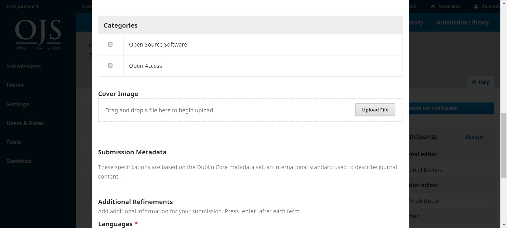

### Inform the Section Editor

Finally, you will need to inform the Section Editor that the galleys have been completed. To do so, use the Production Discussion panel and choose the _Add Discussion_ link.

Add the Section Editor to the top of the page, and then include a subject line and message. Hit **OK** to send the message.

You can now see the final discussion.

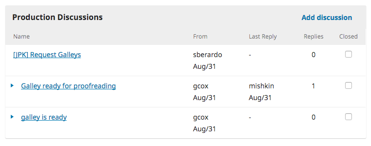

### Section Editor Informs Editor

At this point, the Section Editor receives the notification from the Layout Editor and reviews the galley files.

They can either ask the Layout Editor to make additional changes \(using the Production Discussions\) or inform the Editor that the galleys are ready for publication.

To inform the Editor, use the Production Discussion panel's _Add Discussion_ link.

### Scheduling for Publication

Before you can schedule an article for publication, you have to create an issue. See the [Issues chapter](https://docs.pkp.sfu.ca/learning-ojs/en/issues).

Upon receiving notification of the completed galleys, the editor logs into the submission record, and checks the uploaded galley files.

If the galleys look ready, the editor can hit the blue **Schedule for Publication** action button.

Selecting this button opens a Publication window.

Use this to add the submission to a future or back issue of the journal.

You also have the option to add page numbers, permission, and licensing information.

Hitting **Save** will publish the submission to the selected issue. If the issue is already published, the submission will be immediately available to readers. Otherwise the submission will not be published until the issue is published. See the [Issues chapter](https://docs.pkp.sfu.ca/learning-ojs/en/issues) for how to publish an issue.

Congratulations! You have now come to the end of the editorial workflow.
