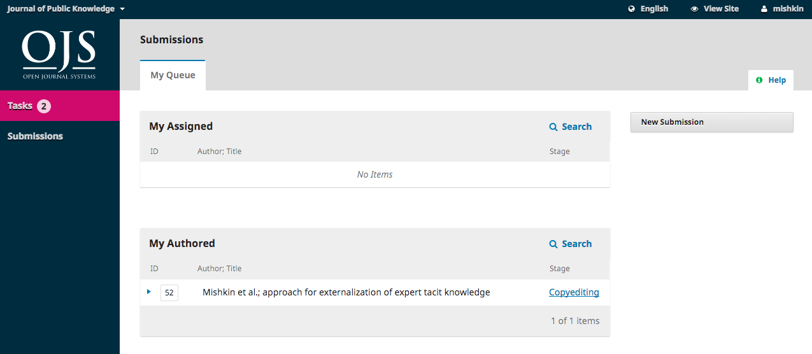

# Responding to a Copyediting Request

The next step in the workflow is to inspect your submission files that have been copyedited.

You will receive an email indicating that files are available. To see them, login to the journal and go to your dashboard.

You can see your entry in the My Authored panel. Select the Copyediting link to go to the full submission record, including the notification in the Copyediting Discussions panel.

Click on the linked discussion to open it, read the message, and open the attached file.

Once you have read the attached file, you can respond to the copyeditor indicating an required changes or your approval.

If needed, you could attach a revision, but for this example we will simply approve the changes and hit **OK**.

On your dashboard, you can see that you were the last person to reply to the message.

Your role in the copyediting process is now complete and you can wait for the request to proofread the final galleys (e.g., PDFs, HTML, etc.) before publication.
