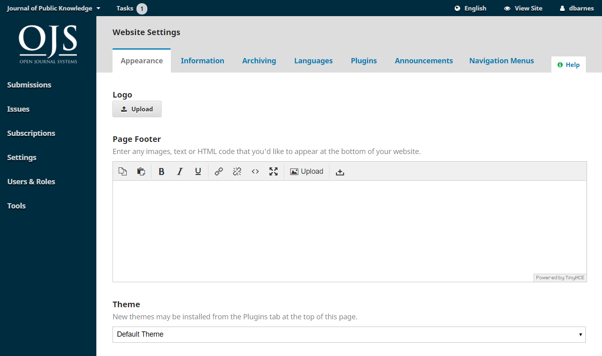
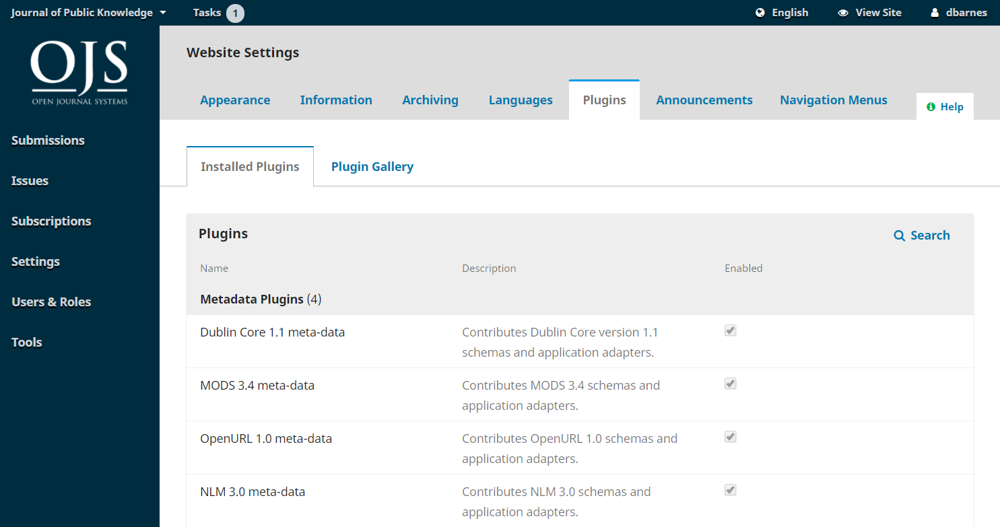
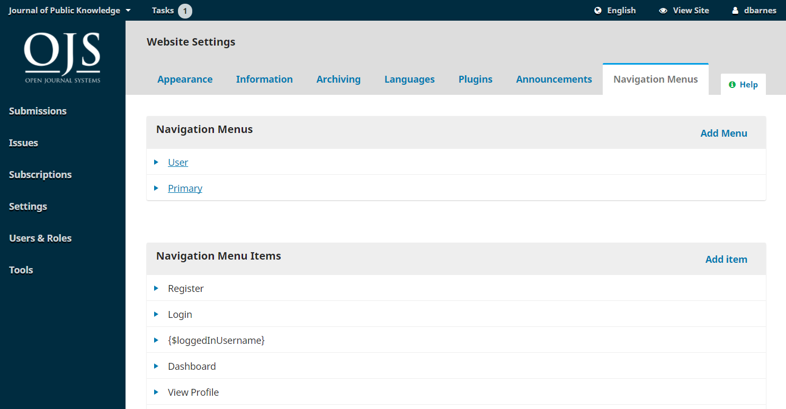
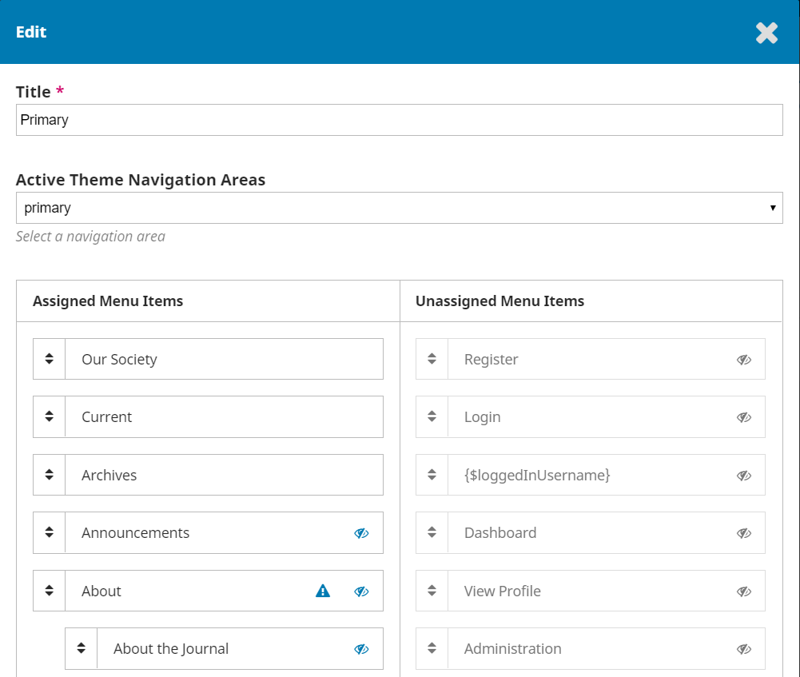

# Chapter 6: Website Settings

The Website Settings allow you to configure how your journal's website looks and operates. It consists of tabs for Appearance, Information, Archiving, Languages, Plugins, Announcements, and Navigation Menus.

## Appearance

**Logo**: Use this space to upload a journal logo to the upper left corner of your reader interface.

**Page Footer**: This allows you to display text at the bottom of each page of your website.

**Theme**: The theme determines the overall design or layout of your site. Several different theme options are available and you can try them out without affecting your site's content or configuration.

First you can ensure that all available themes have been enabled on your site.
1. Go to the Plugins tab under Website Settings.
2. Scroll to the bottom and find Theme Plugins.
3. Check the box next to each plugin to enable it.

You can also look for additional themes in the Plugin Gallery and install and enable those.

Now that you have all available themes, return to the Appearance tab to try out different themes.
1. Under Theme you will see a drop-down list of themes. Select one.
2. Scroll to the bottom of the page and click Save.
3. The theme may have additional sub-themes or configuration options available. To make these appear, refresh the page in your browser.
4. If you select a different sub-theme or change the colour scheme or other design features, click Save at the bottom of the page again.
5. Open your site's home page in a new tab or window of your browser to see how the site looks with the new theme or sub-theme and with different configuration options.
6. If you do not see the changes appear on your site, you may need to clear the cache under the Administration menu.

If you would like to make minor changes to your site's design and layout, you can upload a **Journal Stylesheet**.

If you would like to make more significant changes to the design or give your site an entirely unique look, you can develop your own theme or child theme. Instructions are available in the [PKP Theming Guide](https://docs.pkp.sfu.ca/pkp-theming-guide/en/).

**Typography**: Quickly choose the fonts for your journal.

**Colour**: Quickly change the colour of your journal's header.

**Journal Style Sheet**: Use this to upload a unique style sheet for your journal.

**Sidebar Management**: This allows you to move different blocks in or out of the sidebar in the reader interface.

**Homepage Image**: Uploading an image here will will place it on your journal's home page.

**Journal Favicon**: Add a [favicon](https://en.wikipedia.org/wiki/Favicon) to display in the reader's browser address bar.

**Additional Content**: Any text entered here will appear on your homepage.

**Lists**: Limit the number of items \(for example, submissions, users, or editing assignments\) to show in a list before showing subsequent items in another page. Also, limit the number of links to display to subsequent pages of the list.

**Journal thumbnail**: Upload a small logo or image representative of the journal that will be used in lists of journals on this OJS installation. This will only be used on OJS installations with multiple journals.

Hit **Save** to record your changes.

## Information

Use these fields to modify the text in the For Readers, For Authors, For Librarians pages on the journal website.

Remember to hit **Save** to record any changes.

To remove these fields and their contents from displaying publicly on the website's user interface, deselect the Information Block in Website Settings > Appearance > Sidebar Management.

## Archiving

If you are a member of a LOCKSS or CLOCKSS network, use this page to activate your journal. The PKP PN Plugin, which deposits your content in the PKP Preservation Network, is not yet available for OJS 3.  When it is available and has been enabled, it will deposit your content directly in the Network.

If you use another network, enabling it here will make your content available to the network, but you will also need to contact the network to make it aware of your journal.

## Languages

OJS is multilingual, which means that the interface, emails, and published content can be available in multiple languages on a single site or journal. When you install OJS, you can select one or more languages for your site.

Under Website Settings > Languages you can see a list of languages or locales installed on your site and configure how the languages are used in your journal. Additional languages can be installed on your site by an Administrator – see [Chapter 4](https://docs.pkp.sfu.ca/learning-ojs/en/site-administration) for details.

**Primary Locale**: One language must be set as the primary locale, which means the language the journal appears in by default

**UI**: If you want the journal’s interface to be available in other languages, select them here

**Submission**: If you want authors to be able to make submissions in other languages, select them here

**Forms**: This will enable all selected languages to be available when filling in online forms.

If enabling multiple languages to appear in the UI, make sure that in Website Settings > Appearance > Sidebar Management the Language Toggle Block is selected to make that feature available to users.

## Plugins

Use this page to see all of the installed plugins and find new plugins.

### Installed Plugins

All of the plugins listed here are available in your OJS installation. Check the Enable link to use them.

You will notice that some plugins are required for the system and cannot be disabled.

Click the blue arrow next to the plugin name to reveal links to Delete, Upgrade, or Configure settings for the plugin.

### Plugin Gallery

The Plugin Gallery provides access to externally-created plugins, that may not be included in your OJS installation, but are available for download and activation. Only an Administrator user can install a new plugin.

Selecting the plugin title will provide additional details, including the author, status, description, and compatibility.

### External Plugins

Sometimes new plugins or plugins that are developed by folks outside of PKP will not appear in the Plugin Gallery and you need to install them separately.
1. Download the tar.gz file or .zip file of the plugin from its repository.
2. Go to Installed Plugins tab.
3. At top right, click Upload a New Plugin.
4. Upload the plugin file.
5. When it has finished uploading, click Save. Give it some time to install.

If upload fails you may get an error message that says, “The uploaded plugin archive does not contain a folder that corresponds to the plugin name.” Usually this means you have to change the name of the plugin folder inside the zipped folder to a more simple name. For example, change “translator-ojs-3_0_0-0” to “translator.”

## Announcements

This section allows you to create and display news announcements on the journal's website.

**Announcements**: Configure how announcements will appear on your journal website.

**Announcement Types**: You can create different types of announcements \(e.g., News, New Issue Alert, etc.\). Use the _Add Annoucment Type_ link to create them.

**Announcements**: Use the _Add Announcement_ link to create a new announcement for your Announcements page.

## Navigation Menus

This section allows you to configure your navigation menus, such as including new links.

**Navigation Menus**: Configure the User Menu \(which includes Language, View Site, and Username\) or the Primary Menu \(on the journal home page, including Current, Archive, About, etc.\).

**Navigation Menu Items**: These are programmed links you can add to either menu above. If you wish to add a link to the Primary Menu \(e.g., "Our Society"\), add it here using the _Add Item_ link.

It will now appear in the list of Navigation Menu Items. Next, go to the desired Navigation Menu \(e.g., Primary\), use the blue arrow to reveal the options, and choose Edit. You can now drag and drop it from Unassigned Menu Items to Assigned Menu Items and into the appropriate location on the menu.

Hit Save to record the change.

