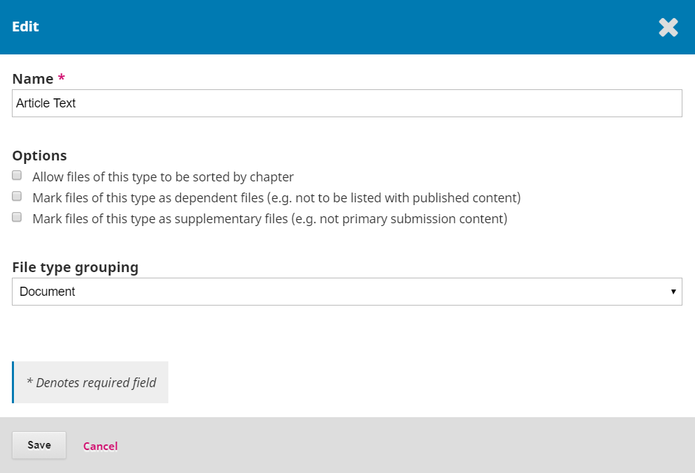
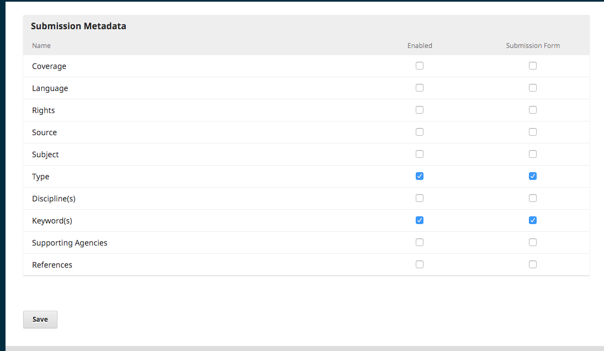
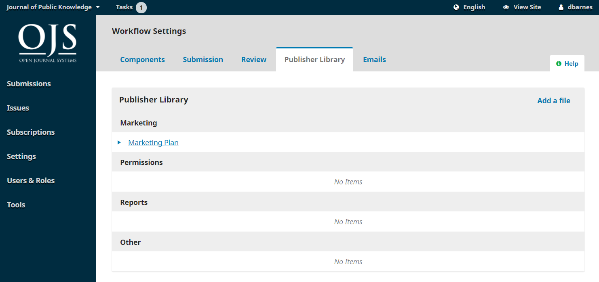
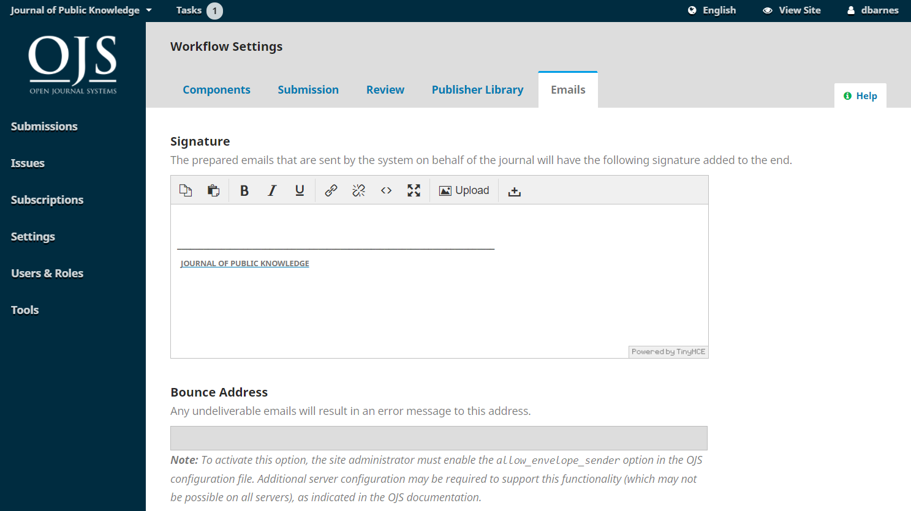

# Chapter 7: Workflow Settings

The Workflow Settings allow you to configure various parts of the journal's editorial workflow. Its tabs include Components, Submission, Review, Publisher Library, and Emails.

## Components

When an author makes a submission, they can upload multiple files. Typically, one file will be the article text, and others can include interview transcripts, data, images, etc. Each of these files is a **component** of the submission. The components available for the author to choose from when making her submission are listed here.

Using the links provided, you can change the **Order** of the components \(how they will be listed to the submitting author\), **Add a Component** \(if something you need is not included by default -- e.g., Video\), or **Restore the Defaults** \(if someone has made too many modifications and you just want to reset everything\).

### Edit Component

You can also edit each component by selecting the blue arrow to the left of the component name. This will reveal an Edit link and a Delete link.

**Name**: This is the name of the component, as presented to the author.

**Options**: Choose how the files associated with this component will be treated and displayed. Anything that is marked as a Dependent file will not be published.

**File Type Grouping**: Determine whether this component is associated with the submission document, artwork, or is a supplementary file.

## Submission

Use this section to configure the submission process.

**Author Guidelines**: Use this field to add guidelines for your authors. This information will be displayed on the journal website.

**Submission Preparation Checklist**: Authors must check off that they agree with each item on this list. Use the _Order_ link to change the order of the items, use the _Add Item_ link to create a new item, and use the blue arrow to the left of the item name to _Edit_ an exiting item.

**Notification of Author Submission**: Add an email address here to be contacted whenever there is a new submission.

**Submission Metadata**: This section allows you to determine which metadata fields to use for your journal.

Each entry is a different metadata type available for every article in your journal.

Some journals may want to activate all of them, but many will wish to keep it simple and just choose Keywords.

If you choose _Enabled_, that metadata type will be added to your submissions for completion by an editor.

If you choose _Submission Form_, that metadata type will also be presented to your authors for them to fill in during their submission.

Remember to hit the **Save** button to record any changes to this page.

**Privacy Statement**: The default privacy statement can be modified if you wish.

## Review

This tab allows you to configure your journal's review process.

**Default Review Deadlines**: Indicate how long reviewers have to decide to accept or decline a review request from the editor, and how long they have to make a recommendation.

**Automated Email Reminders**: Reviewers will automatically be notified when they are assigned to a review; however, you may wish to enable or disable reminder emails for reviewers. Use the drop down menu to select either the number of days or “Never Remind” under “Send a reminder if a reviewer has not responded to a review request within the following time (days) after response due date” to set the number of days that can pass after the due date before reviewers will be reminded to accept or reject a review request.

Use the drop down menu to select either the number of days or “Never Remind” under “Send a reminder if a reviewer has not responded to a review request within the following time (days) after response due date” to set the number of days that can pass after the due date before reviewers will be reminded to make a recommendation for a submission.

 for more information.

**Review Forms**: Review forms provide reviewers with a set of questions to respond to. This can help focus their feedback in ways that is more useful to you.

**Create Review Form**: Use the Create Review Form link to make a new form.

The Description and Instructions provide information about the form and when to use it for Journal Managers and Editors. This content is not included on the form that reviewers see. You can add instructions and guidelines for reviewers under Review Guidelines \(below\).

Back at the Review Forms page, select the blue arrow to the left of the form name to reveal the Edit link.

Select the Edit link and complete the form.

**Items** are form questions.

You can choose whether to make the question required and visible to the author.

You can then choose the type of response, including:

* a single word text box
* a single line text box
* an extended text box \(for longer answers\)
* checkboxes \(where the reviewer can select multiple possible reponses\)
* radio buttons \(where the reviewer can only select one possible answer\)
* dropdown menu \(also where reviewers can only select one possible answer\)

**Response Options** are the selections you make available for the checkboxes, radio buttons, or dropdown menus. A good example of a checkbox response is a [Likert scale](https://en.wikipedia.org/wiki/Likert_scale), where the reviewer must choose only one option: E.g., Good, Neutral, Bad.

Remember to hit the **Save** button to record your changes.

Use the **Preview** tab to test out the form.

Once you send the form to a reviewer you will no longer be able to edit it because that would change the record for existing reviews using that form. If you want to make changes to the review form at that point you can copy the existing form and create a new updated version.

**Blind Review**: Check this box to display a link for instructions on ensuring all submission files are anonymized.

**Competing Interests**: Add your competing interest disclosure policy statement here.

**Reviewer Competing Interest statement**: Add a checkbox that reviewers agree to comply with your competing interest statement.

**Review Guidelines** Provide your reviewers with criteria for judging a submission's suitability for publication in the press, which may include instructions for preparing an effective and helpful review.

**Review Options**: Select whether your journal will follow a double blind, blind, or open review process.

**Reviewer Access**: Enable the first option to provide reviewers with one-click access to the review, by-passing the need to go to the website, login, and find the submission. For security reasons with this option, editors are not able to modify email addresses or add CCs or BCCs prior to sending invitations to reviewers.

Enabling the second option will limit access to submission files until after the reviewer has agreed to do the review.

Hit the **Save** button to record your changes.

## Publisher Library

Use the Publisher Library to store important documents, such as your journal's Marketing Plan, and share them with your editorial team.

## Emails

The section allows you to configure the emails that are sent out from the system.

**Signature**: The information in this field will be added to the bottom of every email sent out by the system.

**Bounce Address**: A notice will be sent to this email address of any system-sent emails that fail to deliver, such as when the targeted email address is no longer valid.

### Prepared Email Tempates

OJS facilitates work flow communication through the use of prepared email messages. You can view and modify these prepared email templates here. Please note, some configuation is required to send email. See the [Administrator's Guide](https://docs.pkp.sfu.ca/admin-guide/en/email) for more information.

#### Disable email templates
 
All of the templates are enabled by default when you install OJS, but you can disable some templates by un-checking the box on the far right under ‘Enabled’. Most of the templates that can be disabled are messages that are sent automatically by OJS. Disabling the template will mean that the automatic notification will not be sent.

#### Edit email templates

When you edit an email template, you change what it will say every time it is used.  For emails that are sent voluntarily, such as a message sent to a reviewer asking them to review a submission, you can also change the contents of the message at the time of sending it. This changes the contents for that message only.

To edit a template:
1. Go to Workflow Settings > Emails > Prepared Email Templates
2. Click the blue arrow next to the template name to reveal links below it
3. Click Edit Email
4. Make changes to the subject and the body text. Be careful to not delete any tags such as “{$authorName}:,” which automatically insert content from a submission.
5. When you’re finished editing, click Save.

#### Reload default email templates

If you have edited email templates but want to reverse the edits and restore them to their default contents, you can reset them:
1. Go to Workflow Settings > Emails > Prepared Email Templates
2. Click Reset All Templates
3. When the confirmation message appears, click OK.

#### Add email template

Although there is a button to Add Email Template, which you can use it to create a custom email template, it will not be available to use at any stage in the workflow. This feature will be available in a future release of OJS 3.x.

#### Add email attachment

There is no direct email attachment option in OJS 3, but you can upload and share public files via the Publisher Library:

1. In Settings > Workflow > Publisher Library > Add a file, upload your document and tick the “Public Access” checkbox
2. Click "OK" for the URL to be generated
3. Insert the URL in your email

You can also choose to modify an existing email template with this URL, or share it publicly on the website.

