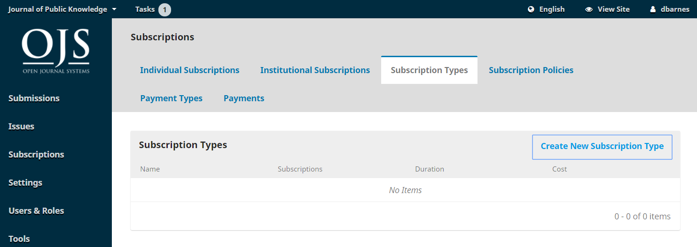

# Chapter 9: Subscriptions

OJS 3.1 allows you to restrict some or all of your content to subscribers. To enable Subscriptions, first go to [Settings &gt; Distribution &gt; Access](./distribution_settings.md).

## Subscription Policies

Fill in details about your subscription policies on this page.

- **Subscription Manager**: Add personal details for the responsible person.
- **Subscription Information**: Add policy details to display on the journal website.
- **Subscription Expiry**: Determine whether past subscribers should continue to have access to older content.
- **Subscription Expiry Reminder**: Configure automated renewal reminders.
- **Online Payment Notifications**: Keep the Subscription Manager informed of payment activities.
- **Open Access Options for Subscription Journals**: If appropriate select the number of current months for restricting access. Older content will be automatically made open.

## Subscription Types

The next step in setting up subscription management is to designate the types of subscriptions the journal offers.

Journals typically offer individual subscription and institutional subscription rates. Some journals may have special offers for members of an organization or students. OJS will support the management of print and/or online subscriptions. More than one type of subscription can be created to cover longer periods of time \(12 months, 36 months\).

Select **Create New Subscription Type** to add a new one.

- **Name of Type**: Give this new subscription type a unique name \(e.g., Student\).
- **Description**: Provide a brief description that will appear on the website.
- **Cost**: Select the currency type and amount.
- **Format**: Choose the appropriate format \(e.g., Online\)
- **Duration**: Enter the number of months this type of subscription will cover \(e.g., 12\).
- **Subscriptions**: Indicate whether this type covers individuals or institutions.
- **Options**: Select the appropriate options \(if any\).

## Payment Types

If you haven't already done so, go to [Settings &gt; Distribution &gt; Payments](./distribution_settings.md) and set the appropriate currency and payment method \(e.g., Paypal\).

Use this page to set the amounts charged for various types of fees.

- **General Options**: Check this to allow for payments to be collected.
- **Author Fees**: Set the amount to charge for an article processing charge \(APC\).
- **Reader Fees**: Use this to charge reader fees distinct from subscriptions.
- **General Fees**: Use this to charge other fees, such as memberships.

## Payments

As various payments are received, they will be listed under this tab.

## Individual Subscriptions

All types of individual subscriptions will appear here.

You can create a new individual subscription by using the Create New Subscription link. First, however, you will need to create a new account for that person under Users & Roles \(see Chapter 7\). Once that is done, you can search for the account here, and apply the different configurations.

**Subscription Type**: Select the appropriate type for this new subscriber \(e.g., Student\) and its status \(e.g., Active\).

> Subscription Types were configured earlier in this chapter.

**Date**: Set the start and end dates for this subscription.

**Membership**: If the subscriber is associated with any relevant memberships, add that information here \(optional\).

**Reference Number**: If the subscribe is associated with any relevant reference number \(such as an invoice number for payment\), add that information here \(optional\).

**Notes**: If you have any relevant notes to add, record that information here \(optional\).

## Institutional Subscriptions

All types of institutional subscriptions will appear here.

Institutional subscriptions are managed similarly to individual subscriptions, but are used for libraries, research institutes, and other organizes that subscribe to your journal.

You can create a new individual subscription by using the Create New Subscription link. First, however, you will need to create a new account for the institution's contact person under Users & Roles \(see Chapter 7\). Once that is done, you can search for the account here, and apply the different configurations.

- **Subscription Type**: Select the appropriate type for this new subscriber \(e.g., Library\) and its status \(e.g., Active\). (Subscription Types were configured earlier in this chapter.)
- **Date**: Set the start and end dates for this subscription.
-  **Institution**: Add the name of the institution for this subscription \(e.g., Simon Fraser University Library\).
- **Mailing Address**: Add the address of the institution.
- **Domain**: Readers coming from a computer with this domain will automatically receive access \(e.g., sfu.ca\). This will apply to on-campus users.
- **IP Ranges**: The institution may provide you with IP ranges. Readers coming from a computer from this IP range will automatically receive access.
- **Notes**: If you have any relevant notes to add, record that information here \(optional\).
