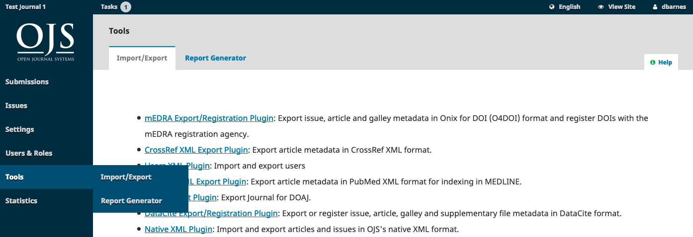
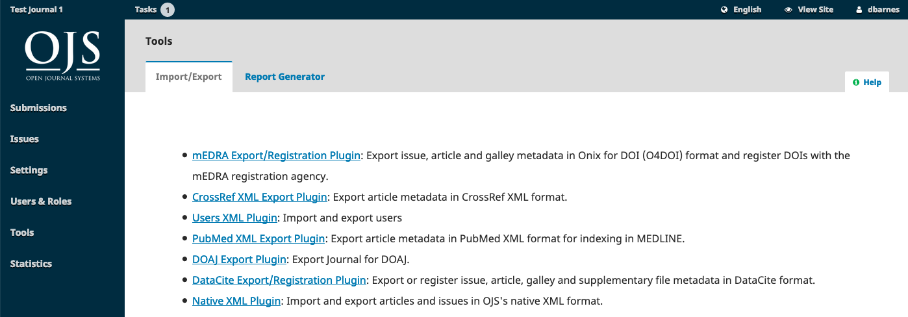
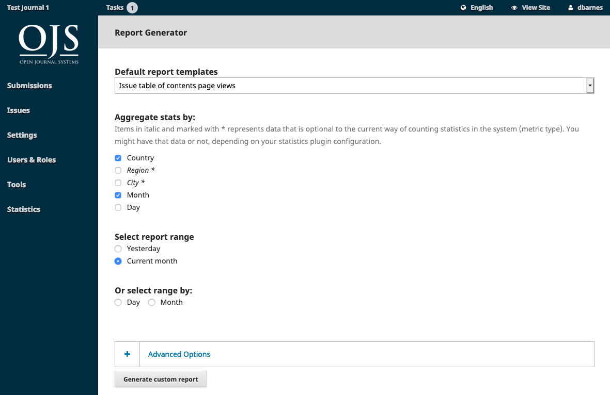

# Chapter 11: Tools

The Tools section can be accessed from the left sidebar menu.

Tools consist of an Import/Export tab and a Report Generator tab (called Statistics in OJS 3.1.1 and earlier).

## Import/Export

Import/Export allows you to easily get data out of your OJS journal and get data into it.

Some of the tools allow you to export to third-party systems, such as PubMed or the DOAJ. Others allow you to import or export user or article data.

For detailed instructions on importing and exporting see the [Administrator's Guide](https://docs.pkp.sfu.ca/admin-guide/en/data-import-and-export).

For more information on the Crossref XML Export Plugin, see the [PKP Crossref Guide](https://docs.pkp.sfu.ca/crossref-ojs-manual/en/).

## Report Generator

The Report Generator page provides access to a variety of reports from your journal.

The system generates reports that track the details associated with site usage and submissions over a given period of time. Reports are generated in CSV format which requires a spreadsheet application to view.

- **PKP Usage Statistics Report**: Provides basic usage statistics for your journal.
- **View Report**: Provides a report on galley and abstract views by readers \(i.e., how many times a PDF for an article has been viewed\).
- **Articles Report**: Provides a spreadsheet of all published articles.
- **COUNTER Reports**: Provides COUNTER data.
- **Subscriptions Report**: Provides a spreadsheet of subscription activity.
- **Review Report**: Provides a spreadsheet of all review activity.

### Generate Custom Report

Use this feature to build your own reports.

More information on how to generate and manage statistics in OJS is provided in the [Administrator's Guide](https://docs.pkp.sfu.ca/admin-guide/en/statistics).
