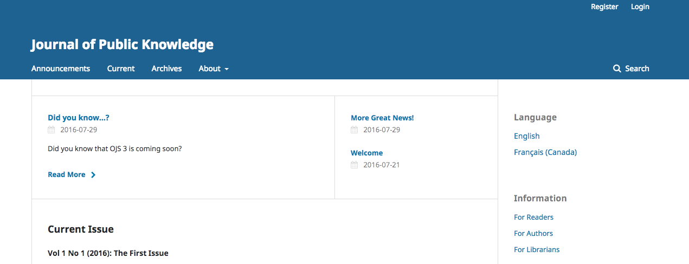
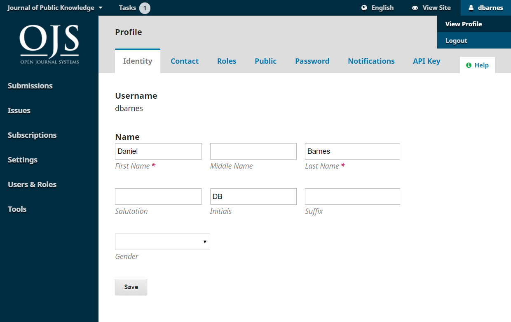
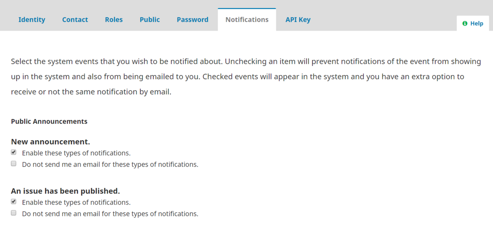
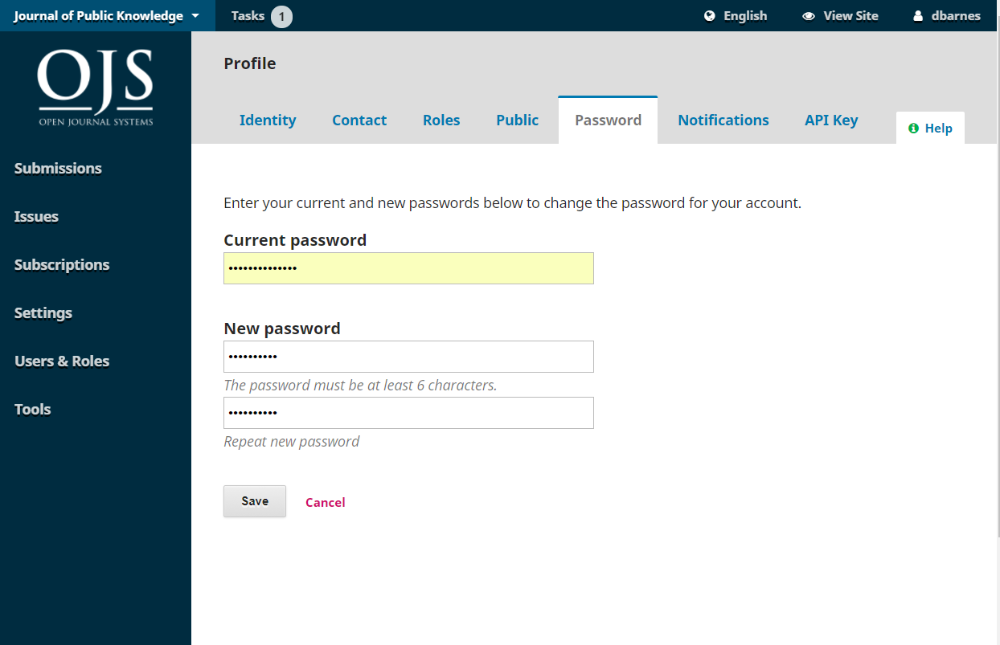

# Chapter 3: User Accounts

OJS uses a comprehensive roles system to divide work between users, assign workflows, and limit access to different parts of the system.

Since one installation of OJS can host multiple journals, users can be enrolled in different roles for more than one journal. For example, one person could be both an editor and author for the same journal, as well as being only an author in one journal, a reviewer in another, and an editor in a third.

When a user logs into the system, they will be taken to their Dashboard. From here, they will see all of the functions of the system to which they have access. For example, a Reviewer will only see the submission they have been assigned to review, while an Editor will see all of the submissions in the editorial workflow.

## Roles in OJS

The OJS workflow revolves around different roles for different users, allowing them access to different parts of the workflow, and different permissions and responsibilities.

Major roles include Site Administrator, Journal Manager, Editor, Section Editor, Author, Reviewer, Copyeditor, Layout Editor, Proofreader, and Reader.

OJS 3 also includes additional roles such as Translator and Designer. You can also create new roles or rename existing ones. More information on configuring roles is available in the [Users and Roles chapter](./users-and-roles.md).

### Site Administrator
The Site Administrator is responsible for the overall OJS installation, ensuring the server settings are accurate, adding language files, and creating any new journals on the installation. The Site Administrator account is created as part of the installation process. Unlike all other OJS roles, there can only be one Site Administrator.

See [Chapter 4: Site Administration](./site-administration.md) for more details.

### Journal Manager
The Journal Manager is responsible for setting up the journal web site, configuring the system options, and managing the user accounts. This does not involve any advanced technical skills, but entails filling out web-based forms and uploading files.

The Journal Manager also enrolls the Editors, Section Editors, Copyeditors, Layout Editors, Proofreaders, Authors, and Reviewers.

The Journal Manager also has access to the journal's other management features, and can create new Sections for the journal, set up Review Forms, edit the default Emails, view statistics and reports, import and export data, and access the editorial workflow and all journal submissions.

See the Settings chapters for more details.

### Author

Authors are able to submit manuscripts to the journal directly through the journal's website. The Author is asked to upload submission files and to provide metadata or indexing information (the metadata improves the search capacity for research online and for the journal). The Author can upload multiple files, in the form of data sets, research instruments, or source texts that will enrich the item, as well as contribute to more open and robust forms of research and scholarship.

The Author is able to track the submission through the review and editorial process — as well as participate in the copyediting and proofreading of submissions accepted for publication — by logging in to the journal's website.

See the [Authoring chapter](./authoring.md) for more details.

### Editor

The Editor oversees the entire review, editing and publishing process. The Editor, working with the Journal Manager, typically establishes the policies and procedures for the journal.

In the editorial process, the Editor assigns submissions to the Section Editors to see through Submission Review and Submission Editing. The Editor keeps an eye on the submission's progress and assists with any difficulties.

Once review is completed, the Editor typically sees the submission through the Editing process (including copyediting, production, and proofreading) although in some journals this remains the responsibility of the Section Editor in charge of the submission's review process.

The Editor also creates the journal issues, schedules submissions for publication, arranges the Table of Contents, and publishes the issue as part of the Publishing Process. The Editor can restore archived submissions to the active In Review or In Editing lists.

Editors can also access journal settings, users and roles, and tools.

See the [Editorial Workflow chapter](./editorial-workflow.md) for more details.

### Section Editor

The Section Editor manages the review and editing of submissions to which they have been assigned. In some cases, a Section Editor who is assigned to see submissions through the Review Process will also be responsible for seeing the submissions that are accepted through the Editing process (that is, through copyediting, production, and proofreading).

Often, however, Section Editors only work with the review process, and an Editor, acting in the role of Section Editor, sees the submissions through the Editing process. The journal will have a policy on how the tasks are divided.

See the [Editorial Workflow chapter](./editorial-workflow.md) for more details.

### Reviewer

The Reviewer is selected by the Editor or Section Editor to review a submission. Reviewers are asked to submit reviews to the journal's website and are able to upload attachments for the use of the Editor and Author. Reviewers may be rated by Section Editors, again depending on the policies for this journal.

See the [Reviewing chapter](./reviewing.md) for more details.

### Copyeditor

The Copyeditor edits submissions to improve grammar and clarity, works with authors to ensure everything is in place, ensures strict adherence to the journal's bibliographic and textual style, and produces a clean, edited copy for a Layout Editor or Production Assistant to turn into the galleys that will be in the published format of the journal.

Some journals have an Editor or Section Editor play this role.

See the [Editorial Workflow chapter](./editorial-workflow.md) for more details.

### Layout Editor

The Layout Editor transforms the copyedited versions of the submission into galleys in HTML, PDF, XML, etc. -- files which the journal has elected to use for online publication.

>Note
>
>OJS does not currently provide software for automatically converting word processed documents to galley formats (although a project is in development), so the Layout Editor should have access to and be able to use third-party software packages for creating galleys.
>

In some cases, the Editor or Section Editor will also serve as Layout Editor.

See the [Editorial Workflow chapter](./editorial-workflow.md) for more details.

### Proofreader

The Proofreader carefully reads over the galleys in the various formats in which the journal publishes (as does the author). The Proofreader (and the Author) record any typographic and formatting errors for the Layout Editor to fix.

In the case of some journals, the Editor or Section Editor will also serve as Proofreader.

See the [Editorial Workflow chapter](./editorial-workflow.md) for more details.

### Reader

The Reader role is the simplest role in OJS, and has the fewest capabilities. Readers receive a notification email with the publication of each issue, which includes the Table of Contents for that particular issue.

## Registering with a Journal

Unregistered visitors to a journal can normally register as a Reader, Author, and/or Reviewer. Journal Managers are able to remove the ability for visitors to self-register, in which case a notice will appear stating that registration is currently closed (see Journal Settings), but Journal Managers can always register users at any time, and for any role.

To register with a journal, click the Register link on the upper right corner.

This will open the Registration Form for you to complete with all required information.

All fields with an asterisk (First Name, Last Name, Affiliation, Country, Email, Username, Password, Repeat Password) are mandatory. If the journal is multilingual, you will need to select your preferred language.

You will be automatically registered as a Reader and an Author. You will be given the option to register as a Reviewer as well.

You will not be able to self-register for an Editorial Role (e.g., Editor, Section Editor, Copyeditor, Layout Editor, Proofreader, or Journal Manager). If you need to be enrolled at that level, contact a current Journal Manager or Site Administrator.

## Viewing and Changing your Profile

To view and edit your profile, log in and click your Username link from the upper right corner. Choose the View Profile link.

From here, by choosing the different tabs, you can update your personal details, contact information, change your roles, add a personal image \(which some journals may publish along with your article or on a list of editors\), determine your notification settings, or update your password.

Under **Notifications**, you can configure what kinds of notifications you receive from the journal when events occur, such as a new journal issue is published or there is activity on a submission you're involved in.
* Check off "Enable these types of notifications" if you want to see a notification of this event on your dashboard when you log in to the site
* Check off "Do not send me an email for these types of notifications" if you do not want to receive an email notification about this event

The **API tab** on the user profile allows you to use OJS’s REST API to interact with external applications.  However, most users will not use the API and can ignore this tab.

## Resetting your Password

You can reset your password by:

1. Logging into the journal
2. Selecting your username and View Profile from the upper right corner of the screen
3. Choosing the Password tab
4. Entering your current password and then your new password twice
5. Hitting Save

Your password is now changed.
