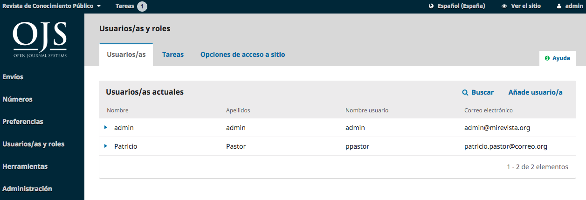
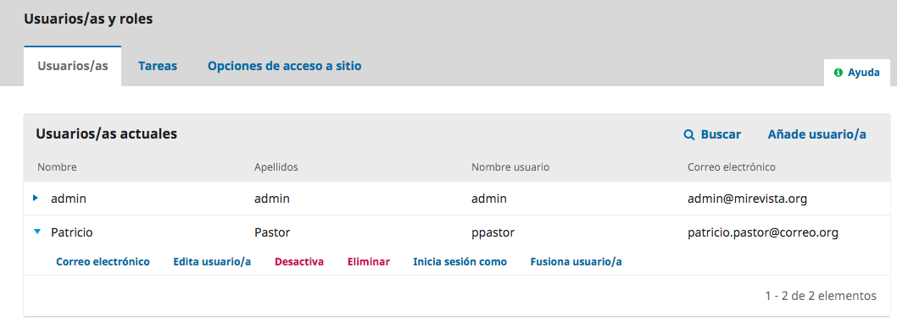
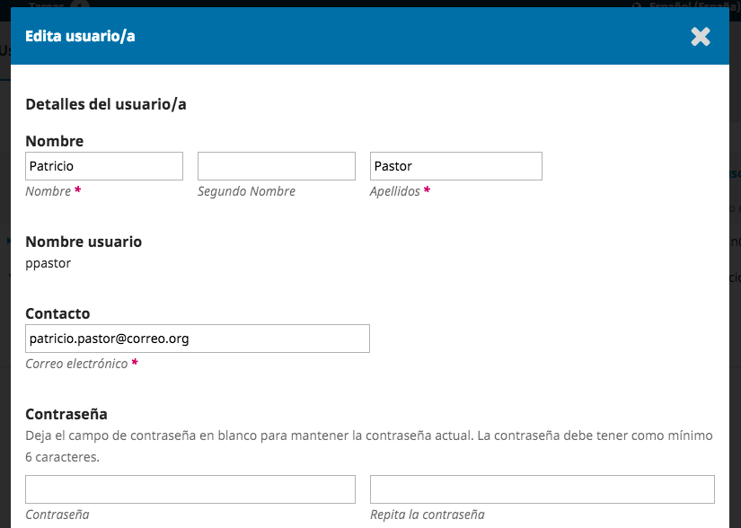
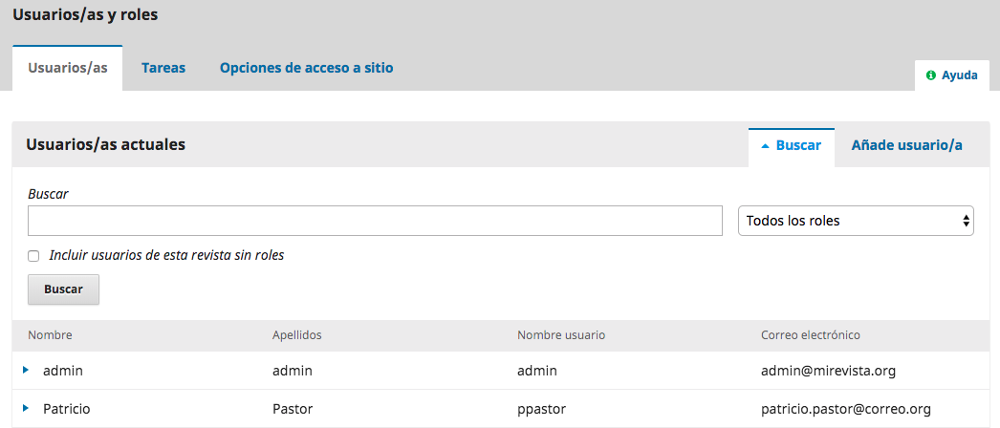
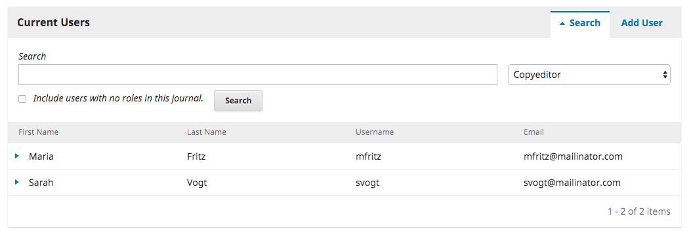
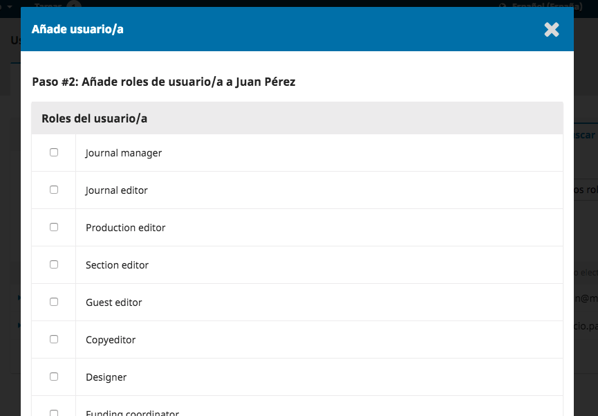
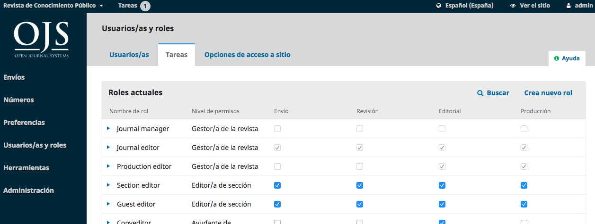
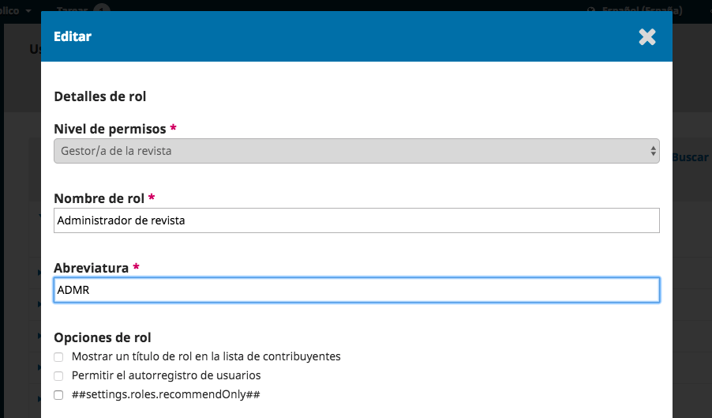
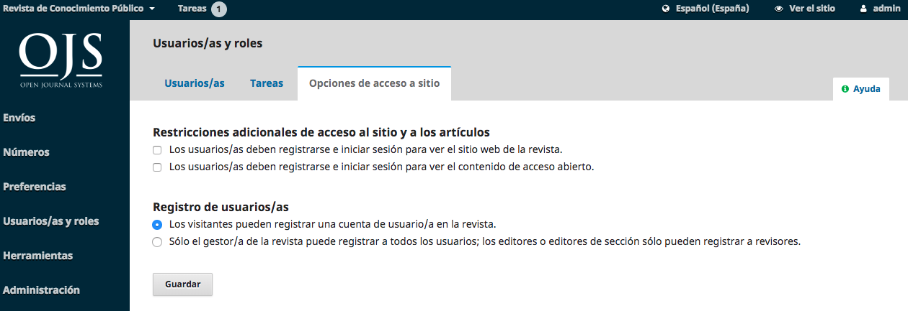

# Capítulo 8: Usuarios y roles

Esta sección proporciona acceso a todas las cuentas de usuario asociadas con su revista, así como la oportunidad de administrar roles y permisos.

## Usuarios
Además de administrar el sitio web de la revista, el Administrador de revistas también es responsable de todas las cuentas de usuario del sistema.

Para ver las cuentas de usuario, seleccione Usuarios y Roles en el menú de la izquierda.

### Usuarios

Los usuarios se muestran en orden de apellido.

Puede editar una cuenta de usuario seleccionando la flecha azul a la izquierda de una entrada.

Se abren las opciones Enviar por correo electrónico, Editar usuario, Desactivar, Eliminar, Iniciar sesión como, Fusionar usuario.

El **correo electrónico** abre una ventana que le permite enviar rápidamente un mensaje a ese usuario.

Editar usuario le permite realizar cambios en la cuenta de ese usuario.

**Desactivar** mantiene la cuenta en su lugar, pero impide que el usuario acceda a ella.

**Eliminar** borra la cuenta de usuario de los registros de la revista y el usuario ya no puede iniciar sesión, pero la cuenta permanece en el sistema.

**Inicio de sesión Como** le permite iniciar sesión temporalmente como ese usuario, por ejemplo, para completar una tarea pendiente.

**Fusionar usuario** le permite plegar esta cuenta de usuario, incluyendo cualquier envío o asignación, en otra cuenta de usuario de su sistema.

Nota: Esta es la única manera de eliminar completamente una cuenta del sistema.

Es posible que desee crear una cuenta de usuario ficticia (por ejemplo, Usuarios eliminados) y utilizarla para fusionar cuentas no deseadas.

### Buscar

Cuando tenga un gran número de usuarios, querrá aprovechar la función de búsqueda.

Esto puede ayudarle a encontrar rápidamente un usuario por nombre, apellido o dirección de correo electrónico, o para ver a todos los usuarios en una función en particular.

Nota: Si deja el campo Buscar en blanco, selecciona un rol y pulsa Buscar, obtendrá una lista de todos los usuarios en ese rol (por ejemplo, todos los editores).

### Añadir usuario
Para agregar un nuevo usuario a de su revista, seleccione el enlace **Añadir usuario**. Esto abrirá una nueva ventana con un conjunto de campos para rellenar.

Una vez completados estos campos y pulsando **Guardar**, se le pedirá que asigne funciones a la nueva cuenta. Utilice el enlace **Añadir Rol** para abrir el selector de roles.

Una vez que haya añadido todas las funciones, pulse el botón Guardar.

## Roles/Tareas

Los usuarios del sistema deben tener uno o más roles/tareas.

Los roles/tareas definen lo que un usuario puede hacer dentro del sistema. Un **autor** puede hacer envíos y poco más. Un **Editor** puede administrar los envíos y un **Administrador** de revistas puede configurar los parámetros de la revista.

Un usuario puede tener más de un rol/tarea, por ejemplo, ser **Administrador** de revistas, **Editor** y **Autor** en la misma revista.

OJS 3 tiene múltiples roles/tareas disponibles, cada uno con diferentes niveles de permiso.

Desde esta página, puedes ver cada rol/tarea, y la etapa editorial a la que cada rol/tarea puede acceder. Un buen ejemplo de esto es el rol Corrector, que sólo puede acceder a la etapa de edición. Los correctores no pueden saltar a la etapa de revisión para ver qué pasó durante el proceso de revisión por pares. Consulte el [Capítulo 11](editorial-workflow.md) para obtener más información sobre las diferentes etapas editoriales.

## Tratamiento de funciones

Al desmarcar una casilla se elimina el acceso a esa etapa para los usuarios con esa función.

Al seleccionar la flecha azul a la izquierda del nombre del rol, se muestra el enlace de edición. Al hacer clic en este botón se abre la ventana de edición.

**Nivel de Permiso**: Indica lo que un usuario con este rol puede hacer en cualquier etapa. El nivel de Asistente de la revista puede comunicarse con otros usuarios y subir y revisar archivos.

**Nombre del rol**: Puede utilizar este campo para renombrar fácilmente cualquier rol.

**Abreviatura**: Cada rol debe tener una abreviatura única.

**Asignación de etapas**: Permite determinar a qué etapa pueden acceder los usuarios con esta función.

Opciones de rol: Utilice estas casillas de verificación para mostrar a cualquiera que tenga este rol en la lista de colaboradores (por ejemplo, la lista de autores).

Utilice la segunda opción para determinar si los usuarios pueden autoregistrarse en esta función. Los autores y revisores son buenos candidatos para el auto registro. Definitivamente NO querrá permitir que los usuarios se registren como administradores o editores de revistas!

La tercera opción es útil para editores invitados o posiblemente para editores de secciones, dependiendo de su flujo de trabajo preferido y de la cadena de autoridad.

## Crear nuevos roles

Utilice el enlace Crear nuevos roles para abrir una ventana en la que puede crear una nueva función para de su revista, incluida la configuración de las etapas a las que puede acceder y la cantidad de permisos que debe tener

8.3 Opciones de acceso al sitio
Esta página le permite determinar cómo los lectores pueden acceder a su revista.

**Restricciones adicionales de acceso al sitio y al artículo**: Elija entre estas opciones para limitar el acceso.

Tenga en cuenta que aunque el registro para leer contenido de acceso abierto puede ser conveniente para su seguimiento, puede disuadir a algunas personas de leer su contenido. Usar con cuidado.

**Registro de usuario**: Esta opción permite determinar si los usuarios pueden crear sus propias cuentas o si deben ser registrados por un administrador de la revista.

Permitir que los usuarios se registren, pero sólo en los roles de Autor, Revisor o Lector, es una buena opción.
