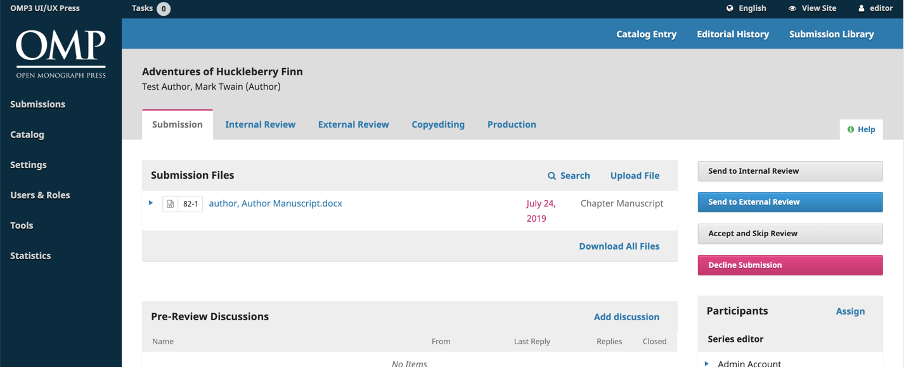

# Editorial Interface

OMP 3.x  has a separate interface once you log into the editorial system. This makes it easier to customize the reader interface. 

The editorial interface is known as your dashboard and consists of the following elements:
1. __Top Navigation Bar__: To the left, you will find the name of the press with which you are currently working (e.g., OMP3 UI/UX). If you are enrolled in more than one press on your OMP installation, you can use this to switch between presses. Next to that are your Tasks (items needing immediate attention). To the right, you can switch languages if the press is multilingual, view the reader interface, or click on your username to view your profile or logout.

2. __Left Menu Panel__: These are the major sections of the dashboard, including the submissions, catalog, settings, user and role management, tools, and statistics. Users with fewer permissions (e.g., Authors, Reviewers, Copyeditors, etc.) will see fewer options here.

3.__Blue Navigation Bar__: These menu choices are specific to the various sections of the editorial workflow. Catalog Entry, Editorial History, and Submission Library are all part of the submission record visible below.
4.__Main Panel__: In the main panel you will see the current work area. In the image above, you are looking at a submission record in the Submission stage.

5.__Main Panel Submenus__: Within the Main Panel, you will often see tabs that allow you to view various information about the content with which you are currently working. In this example, the submission record is broken into five sections (Submission, Internal Review, External Review,  Copyediting, Production). Notice the Help tab to the right, which provides context-sensitive help for the page you are currently viewing.

6.__Right Panel__: From here, you can see the action buttons, such as Send to Internal Review. Different pages have different action buttons. Below the action buttons is the Participants table, which lists everyone (except Reviewers) involved in the submission.
